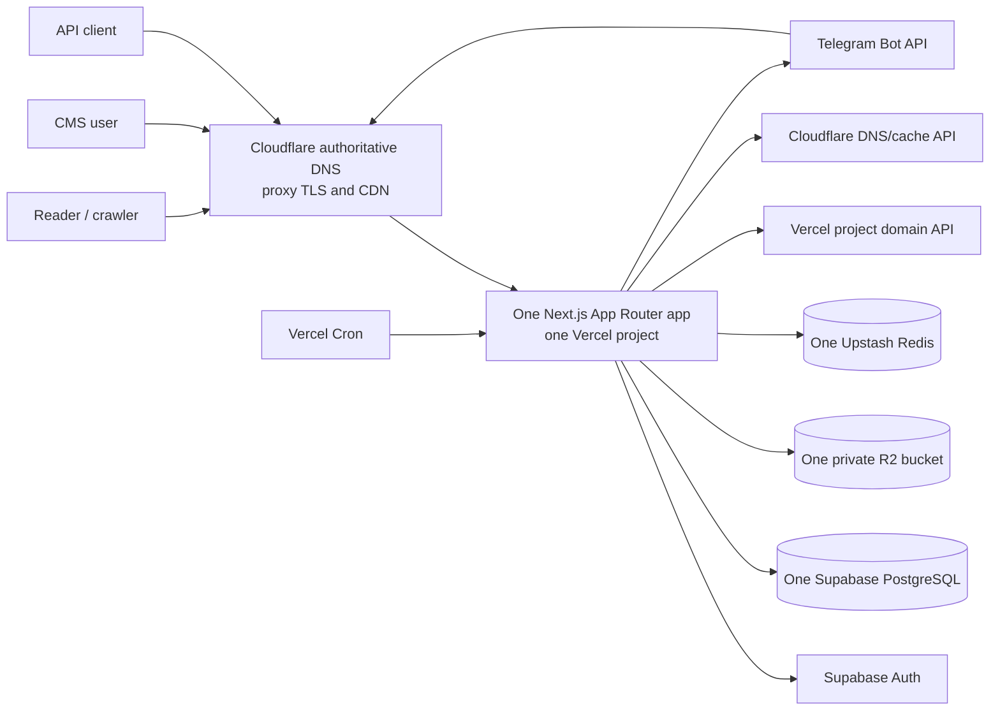
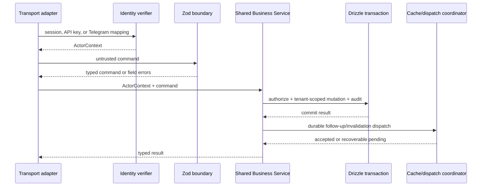
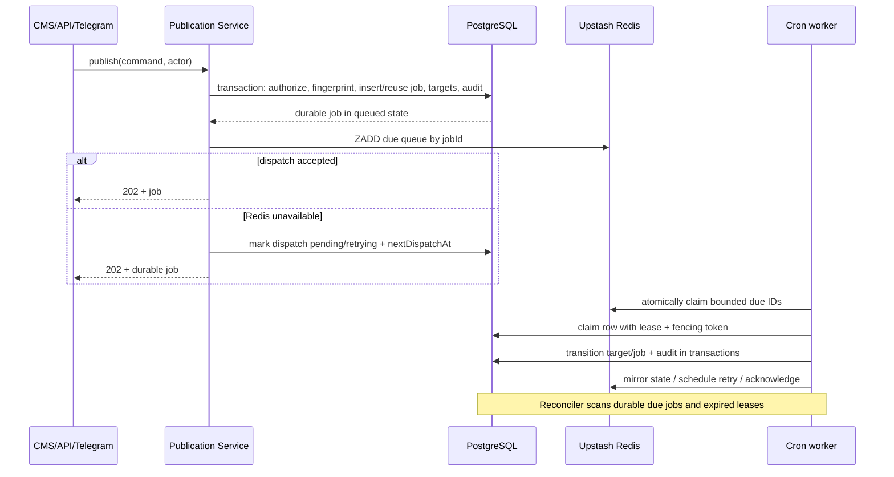
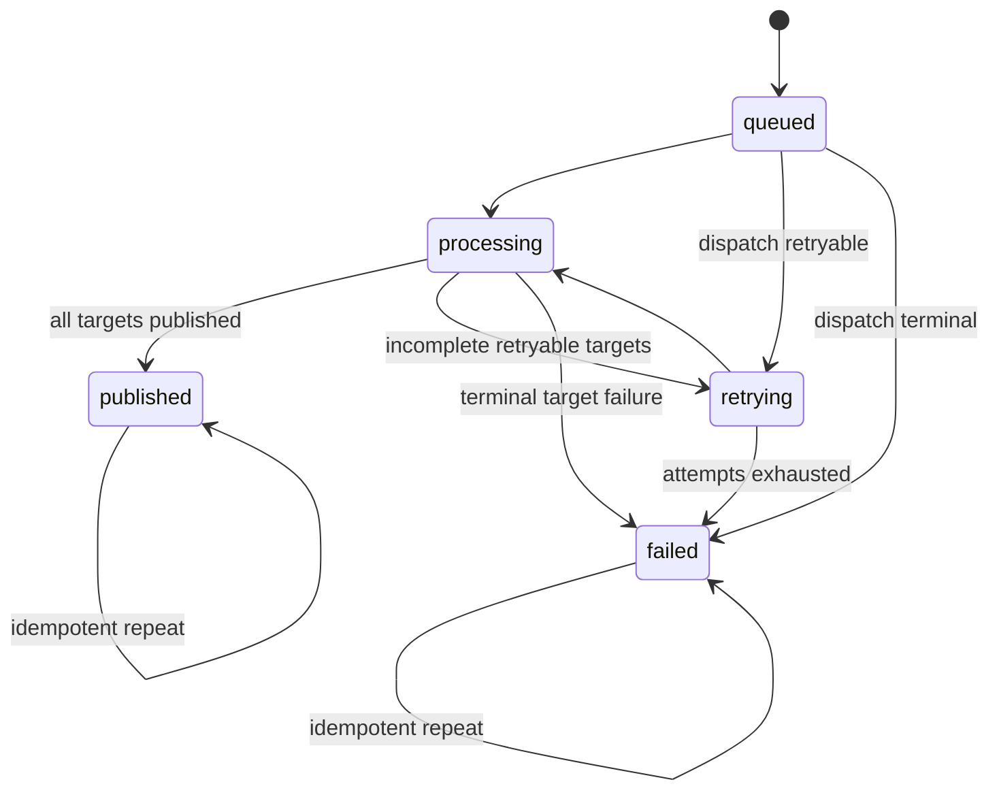
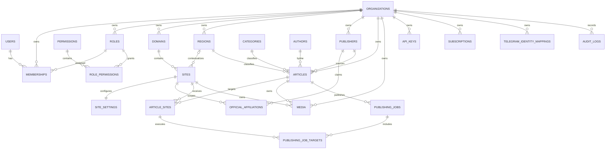

# Indicate MVP Technical Design

## Overview

Indicate MVP is one tenant-aware Next.js App Router application deployed as one Vercel project. It serves the protected CMS and control-plane endpoints at reserved hostnames and a shared public news template at every configured publication hostname. One Supabase project supplies PostgreSQL and Auth, one Cloudflare R2 bucket stores media, and one Upstash Redis database coordinates dispatch, retries, rate limits, idempotency acceleration, and cache invalidation. Cloudflare remains authoritative for nameservers, DNS, wildcard records, edge TLS proxying, and CDN behavior.

The design treats PostgreSQL as the durable source of truth. Redis entries, Vercel Cron invocations, cache entries, and external domain state are recoverable projections. Every tenant-scoped operation carries an immutable `organizationId`; database predicates and composite constraints enforce that scope, and authorization is re-evaluated at every entry point and background claim. No public hostname can select a fallback tenant.

### Goals and invariants

1. One codebase, Next.js application, Vercel project, Supabase project/database/Auth instance, R2 bucket, Upstash Redis database, and public template serve all tenants and hostnames.
2. A normalized hostname resolves by exact equality to either one reserved control-plane surface or one active Site. Missing, malformed, ambiguous, suffix-only, and substring-only matches never select tenant data.
3. Organization ownership is explicit in every tenant entity, query, object authorization, queue key, cache key, metric, and audit event.
4. Canonical Article content exists once; `article_sites` represents destination assignment and current publication outcome, while immutable job-target records preserve execution history.
5. Publication acceptance is transactional and idempotent. Redis dispatch may fail without losing the durable job, and bounded reconciliation recovers missed or duplicate Vercel Cron runs.
6. Public rendering, URLs, SEO, media access, and cache identity derive from the same resolved Hostname Context.
7. Security-sensitive mutations and their Audit Logs commit atomically. Secrets, hashes, signed URLs, and internal diagnostics never enter public errors or audit context.
8. The implementation follows the seven required Major Stages. `docs/PRD.md` and `docs/ARCHITECTURE.md` must be created and approved before any application code; this design does not create either document or application code.

### Non-goals

- Separate deployments, databases, buckets, Redis resources, or templates per tenant or domain.
- Vercel nameserver delegation or Vercel-managed wildcard-domain registration.
- A long-running worker, an additional queue service, a second ORM/auth provider, or direct browser database access.
- Destination-specific copies of Article title/body.
- Publicly exposing the R2 bucket or relying on object-key obscurity for authorization.

### Research summary and design consequences

Research focused on constraints that materially affect the design:

- [Vercel multi-tenant domain guidance](https://vercel.com/docs/multi-tenant/domain-management) states that Vercel wildcard-domain registration requires Vercel nameservers. Therefore, Indicate uses Cloudflare wildcard DNS but individually associates each active persisted Site hostname with the single Vercel project. It does not register `*.root.web.id` as a Vercel wildcard. Vercel documents high per-project domain capacity for multi-tenant projects in its [multi-tenant limits](https://vercel.com/docs/multi-tenant/limits).
- [Cloudflare wildcard DNS](https://developers.cloudflare.com/dns/manage-dns-records/reference/wildcard-dns-records/), [Universal SSL](https://developers.cloudflare.com/ssl/edge-certificates/universal-ssl/enable-universal-ssl/), apex CNAME flattening, and [Full (strict)](https://developers.cloudflare.com/ssl/origin-configuration/ssl-modes/full-strict/) support Cloudflare-authoritative apex and first-level regional hostnames proxied to a certificate-valid Vercel origin.
- [Vercel Cron behavior](https://vercel.com/docs/cron-jobs/manage-cron-jobs) is best effort, may overlap or duplicate, and does not retry failed invocations. Consequently, cron handlers perform short bounded batches, use leases and fencing tokens, and reconcile durable PostgreSQL state instead of assuming exactly-once scheduling.
- [Supabase connection guidance](https://supabase.com/docs/guides/database/connecting-to-postgres) recommends transaction pooling for serverless functions and a direct connection for migrations. Runtime Drizzle queries use the transaction pooler; migrations use the direct migration credential.
- [Upstash Redis queue guidance](https://upstash.com/docs/redis/tutorials/redis_queue) supports atomic list/sorted-set operations and atomic scripts. The design uses sorted sets for due work and atomic claims, while treating Redis as an accelerator rather than the system of record.
- [R2 presigned URLs](https://developers.cloudflare.com/r2/api/s3/presigned-urls/) authorize one operation on one object until expiry. Indicate reserves a collision-resistant key in PostgreSQL before issuing a bounded PUT/GET authorization and validates object metadata afterward.
- Next.js supports dynamic metadata, route metadata files, JSON-LD, and tagged revalidation ([metadata](https://nextjs.org/docs/app/getting-started/metadata-and-og-images), [JSON-LD](https://nextjs.org/docs/app/guides/json-ld), [revalidation](https://nextjs.org/docs/app/building-your-application/data-fetching/revalidating)). Cloudflare supports URL and hostname purges; both layers are addressed by the invalidation coordinator.
- Supabase Auth supports cookie-based Next.js SSR through its [server-side client](https://supabase.com/docs/guides/auth/server-side/nextjs?router=app). CMS authorization still resolves the local User, active Membership, Role, and Permissions on the server for every operation.

Content in this research summary is rephrased for compliance with licensing restrictions.

## Architecture

### System context



All arrows from the application to managed services originate in server-only modules. The browser receives only public Supabase values needed for Auth SSR; it never receives database credentials, privileged Supabase keys, R2 credentials, Redis credentials, Telegram secrets, Cloudflare tokens, Vercel tokens, API-key hashes, or webhook secrets.

### Deployment topology and hostname activation

Each managed root remains a full Cloudflare zone with Cloudflare nameservers. Cloudflare contains a proxied apex CNAME (flattened at the apex) and a proxied `*` CNAME targeting the Vercel project’s stable production target. Cloudflare terminates visitor TLS and uses Full (strict) HTTPS to Vercel. Only first-level regional hostnames are generated (`{regionSlug}.{rootDomain}`), matching Cloudflare Universal SSL coverage; deeper names require an explicitly approved certificate strategy before activation.

Vercel’s wildcard-domain feature is deliberately not used because it would transfer DNS challenge control to Vercel nameservers. Instead, the Domain Provisioning Service runs an activation saga for every exact Site hostname:

1. Validate and normalize the candidate; reject reserved control-plane names, duplicate normalized values, or inactive parent Domain/Region records.
2. Persist a `pending` site-domain activation record without making the Site publicly active.
3. Confirm the root zone’s Cloudflare nameservers, proxied apex/wildcard route, edge certificate coverage, and Full (strict) setting.
4. Associate the exact hostname with the one Vercel project through its domain API. If Vercel requests proof, create the exact Cloudflare TXT challenge, verify it, then remove only the temporary challenge after verification.
5. Probe HTTPS through Cloudflare and verify that Vercel routes the hostname to the production deployment and that the application returns the expected non-indexable pending response.
6. In one database transaction, mark the Site hostname active, increment its routing version, append an Audit Log, and enqueue hostname/cache invalidation.

Deactivation reverses public activation in the database first, so application resolution stops immediately; external DNS/domain cleanup follows asynchronously and is retryable. Reconfiguration records old and new hostnames, validates the new path before activation, and invalidates both Hostname Contexts. No step changes nameserver delegation. Deployment validation fails closed if any expected Cloudflare route, Vercel exact-domain association, certificate, proxy, or database mapping is inconsistent.

### Runtime module boundaries

The application is a modular monolith with compile-time import boundaries:

```text
app/ adapters (routes, Server Components, Server Actions, route handlers)
  -> application/ use cases and business services
     -> domain/ entities, policies, pure state machines, value objects
        -> ports/ repository, auth, queue, storage, clock, id, audit interfaces
           <- infrastructure/ Drizzle, Supabase Auth, R2, Upstash, Telegram, Cloudflare, Vercel
```

- `domain` and pure policy modules import no framework or infrastructure clients.
- `application` accepts an `ActorContext`, validated command, and injected ports; it never reads request globals.
- `infrastructure` clients are server-only and return domain-safe results rather than vendor response objects.
- `app` adapters authenticate, normalize transport input, invoke exactly one application use case, and map typed outcomes to HTML or transport envelopes.
- CMS, API, Telegram, cron, and public adapters cannot issue tenant SQL directly.

### Trust boundaries and actor context

```ts
interface ActorContext {
  actorType: 'user' | 'api_key' | 'telegram' | 'system';
  actorId: string;
  organizationId: string | null;
  permissionSet: ReadonlySet<PermissionName>;
  entryPoint: 'cms' | 'api' | 'telegram' | 'worker' | 'reconciler';
  requestId: string;
}

interface HostnameContext {
  normalizedHostname: string;
  organizationId: string;
  domainId: string;
  siteId: string;
  regionId: string | null;
  routingVersion: number;
}
```

`organizationId` is selected from verified Membership/API Key/Telegram mapping/job ownership, never from an untrusted request body. System workers begin with no organization and adopt exactly one organization from the atomically claimed durable record. Public reads begin with no organization and receive one only from exact Hostname Context resolution.

### Request classification and exact hostname resolution

The request classifier runs before route-specific data access:

```ts
normalizeHostname(rawHost): Result<string, InvalidHostname> {
  reject missing, repeated/comma-separated, user-info, path, wildcard, IP literal;
  remove one syntactically valid decimal port;
  remove one terminal DNS dot;
  ascii = domainToASCII(value).toLowerCase();
  require ascii length <= 253 and each label 1..63, valid LDH syntax;
  return ascii;
}

resolveRequest(rawHost): ControlPlaneContext | HostnameContext | Error {
  host = normalizeHostname(rawHost) else HTTP_400;
  if (runtime.controlPlaneHosts.has(host)) return exactConfiguredSurface(host);
  site = sites.findActiveByExactNormalizedHostname(host);
  if (!site) return HTTP_404_NON_INDEXABLE;
  if (site is ambiguous) return HTTP_500_NON_INDEXABLE_CONFIG_ERROR;
  return site.context;
}
```

The direct `Host` header delivered by the configured Cloudflare/Vercel path is authoritative. Comma-separated forwarded host values are rejected; client-provided forwarding headers do not override it. Control-plane matching precedes Site lookup. Runtime configuration and database constraints prohibit a Site from claiming any reserved hostname.

The request adapter performs one database exact-match resolution before using tenant cache content. This prevents a stale cache entry from keeping a deactivated hostname alive. Middleware/proxy code may reject malformed hosts and classify static control-plane names, but it does not query PostgreSQL and is not an authorization boundary.

Control-plane hosts map only to explicit route families:

- `indicate.web.id` -> CMS and Auth callback routes;
- configured API hostname -> versioned API routes only;
- configured Telegram/webhook hostname -> named webhook routes only;
- internal cron routes -> Vercel production URL plus `CRON_SECRET`, never public Site routing.

A valid but unknown public host gets a generic non-indexable 404 because no Site branding is trustworthy. A recognized Site with a missing page gets that Site’s branded non-indexable 404.

### Primary request and data flows

#### CMS, API, and Telegram mutation flow



Auth, validation, permission, tenant ownership, optimistic version, mutation, and required audit happen before success is acknowledged. Telegram only owns conversational state and transport formatting; it calls the same service schemas and commands as CMS/API.

#### Public rendering flow

1. Normalize and classify the hostname.
2. Resolve one active exact Hostname Context from PostgreSQL.
3. Build `PublicQuery` using `organizationId`, `siteId`, optional `regionId`, canonical path, normalized query, locale, preview state, auth state, and content/routing versions.
4. Read a hostname-partitioned cached value or query only published `article_sites` and same-Organization relations.
5. Render shared Server Components with persisted Site Settings; unavailable Site media uses a Site-safe static fallback, never another Site’s data.
6. Generate canonical/OG/JSON-LD/robots/sitemap/RSS from the same context and absolute URL builder.
7. Return cache headers only for anonymous public GET/HEAD responses; control-plane, preview, error, and authorization-bearing responses are private/no-store.

#### Publication acceptance, dispatch, and recovery



The request fingerprint is a versioned SHA-256 digest of a canonical encoding of `organizationId`, `articleId`, sorted distinct Site IDs, and normalized publication options. The database unique key `(organization_id, idempotency_key)` is the concurrency authority. Matching fingerprints return the existing job; mismatches return a conflict; the same key in another organization is independent.

The database transaction inserts the Publishing Job, reconciles one `article_sites` row per Site, inserts immutable job-target links, sets initial states, and appends the acceptance Audit Log. Redis dispatch occurs after commit. A failed Redis call cannot erase the job; `dispatch_status`, `next_dispatch_at`, and `dispatch_attempts` make it discoverable.

Upstash sorted sets hold due job IDs and lease-expiry IDs, namespaced by environment. An atomic script claims only due members and moves them to a processing lease. PostgreSQL then performs the authoritative conditional claim, increments `fencing_token`, and sets `lease_expires_at`. Every worker write includes job/target ID, organization ID, expected state/version, and fencing token. A stale worker therefore updates zero rows and cannot overwrite newer state. Workers process a bounded number of jobs/targets and stop before the configured Vercel function time budget. Cron overlap, duplicate delivery, and missed delivery are safe.

A separate reconciliation mode, invoked through the same secured cron handler, scans indexed PostgreSQL rows for: durable jobs missing confirmed dispatch, due retries, expired leases, incomplete transition/audit acknowledgements, and pending invalidations. It uses `FOR UPDATE SKIP LOCKED` in short transactions, redispatches the same logical ID, and never creates duplicate Article Site relationships. No session advisory locks are used because runtime traffic uses transaction pooling.

### Publishing state machines



Article Site target transitions are `queued -> processing`, `processing -> published|retrying|failed`, and `retrying -> processing|failed`. Terminal repeats preserve the original timestamp, URL, and sanitized outcome. Every other requested transition returns `INVALID_STATE_TRANSITION` and changes nothing.

Job state is derived after each target transaction:

1. any `processing` target -> `processing`;
2. otherwise any nonterminal `retrying` target -> `retrying`;
3. all `published` -> `published`;
4. all terminal and at least one `failed` -> `failed`.

Retries affect only incomplete retryable targets. Attempts and delays come from validated bounded Runtime Configuration. The final Publication Result is a database projection: final job state, count of targets whose current Article Site outcome is `published`, and exactly their persisted URLs.

### Cache architecture

Cache layers are intentionally subordinate to hostname resolution:

- Next.js data/full-route cache for public query results, tagged by `host:{hostname}`, `org:{orgId}`, `site:{siteId}`, and affected article/category/publisher/SEO tags.
- Cloudflare CDN for anonymous public GET/HEAD responses. The URL cache key already contains scheme, normalized host, path, and normalized query; cache rules bypass cookies/auth/preview and errors.
- Upstash Redis stores version/invalidation coordination only, not the sole copy of rendered tenant content.

```ts
interface CacheIdentityInput {
  normalizedHostname: string;
  organizationId: string;
  siteId: string;
  regionId?: string;
  locale: string;
  path: string;
  normalizedQuery: string;
  preview: boolean;
  authClass: 'anonymous' | 'authenticated';
  routingVersion: number;
  contentVersion: number;
}
```

Canonical serialization orders keys and query pairs and hashes the complete value. Missing hostname context disables tenant caching. Every cache read compares embedded organization, Site, hostname, and versions to the current context; mismatch is a miss and triggers discard. Preview and authenticated values never share a public key.

Mutations write a durable `invalidation_tasks` record in the same database transaction. The coordinator calls Next.js tag/path revalidation, updates the Upstash version namespace, and purges Cloudflare by exact URLs or hostname. Success marks the task complete. Failure increments bounded attempts, records sanitized context, and sets a Site-level bypass version until retry or a broader Site-hostname purge succeeds.

### SEO architecture

One pure `AbsoluteUrlBuilder` accepts only Hostname Context plus canonical path; user-supplied host headers never reach it. One `SeoDocumentBuilder` emits escaped title/description, canonical, Open Graph, NewsArticle, Breadcrumb, Organization, and WebSite models. Format-specific serializers produce HTML metadata, XML sitemap, RSS XML, robots text, and JSON-LD. JSON-LD is serialized with characters dangerous in HTML script context escaped.

Only active, published, Site-visible Article URLs enter sitemap/RSS. Official claims require a current verified Publisher plus active Official Affiliation whose Site and claim scope match. Unknown hosts, branded 404s, pending domain probes, and sanitized error pages emit `noindex, nofollow` and no cross-Site canonical/structured data.

## Components and Interfaces

### Adapters

| Component | Responsibility | Calls |
|---|---|---|
| CMS route groups and Server Actions | Protected dashboard/modules, forms, Active Organization switching, sanitized outcomes | Auth Gateway, Query Services, Business Services |
| Public route groups | Shared homepage/list/detail/category/search/sidebar/footer and branded errors | Hostname Resolver, Public Content, SEO, Media Authorization |
| Versioned API route handlers | API-key auth, Zod validation, stable envelopes, rate limits | Shared Business Services |
| Telegram webhook adapter | Secret-header/freshness/replay checks, mapping, conversation steps, concise replies | Shared Article/Media/Publication services |
| Cron adapter | `CRON_SECRET` verification, bounded worker/reconciler mode | Dispatch, Publication Worker, Invalidation Coordinator |
| Deployment validation command/route | Validate config, migrations, DNS, Vercel domains, connectivity, webhooks | Infrastructure health ports; no tenant mutation |

CMS modules are `dashboard`, `domains`, `regions`, `sites`, `publishers`, `articles` (including Categories/Authors), `media`, `publishing`, `customers`, `analytics`, `settings`, and `audit-logs`. Each module owns presentation and command mapping only. Shared Tailwind tokens and shadcn/ui primitives drive responsive layouts; Server Components perform reads and small Client Components handle local interaction. Tables become cards or horizontally contained grids at narrow widths; navigation becomes an operable drawer; focus remains visible; reserved media dimensions prevent layout shift.

### Application services

| Service | Selected interface | Key guarantees |
|---|---|---|
| `AuthorizationService` | `authorize(actor, organizationId, permission, resourceRef?)` | Active mapping/membership, exact scope, non-disclosing denial |
| `OrganizationService` | customer/subscription/member/role commands | Platform permission for customers; audit atomicity |
| `DomainProvisioningService` | `requestActivation`, `verifyActivation`, `deactivate` | Reserved-host rejection, exact Vercel association, Cloudflare-only authority |
| `SiteService` | CRUD/settings/activation | Same-org Domain/Region/media; optimistic version |
| `PublisherService` | CRUD/submit/approve/reject/affiliation | Verification evidence lifecycle and controlled claims |
| `ArticleService` | create/read/update/archive/restore/assignSites | One canonical row; same-org references; deduplicated assignments |
| `MediaService` | reserveUpload, completeUpload, authorizeRead, archive | Required prefix, one-key authorization, metadata verification |
| `PublicationService` | requestPublication, getStatus, getResult | Canonical fingerprint, transactional acceptance, tenant idempotency |
| `PublicationWorker` | claimBatch, processTarget, reconcile | Bounded leases/fences/retries; state machine only |
| `PublicContentService` | list/detail/category/search/feed | Published Article Site relation and exact context filters |
| `AnalyticsService` | dashboard/aggregate queries | Organization predicate in every aggregate; zero/empty outputs |
| `SeoService` | page metadata/robots/sitemap/rss | Hostname-correct, escaped, Site-only output |
| `ApiKeyService` | issue/authenticate/rotate/revoke | One-time plaintext, salted one-way hash, atomic rotation/audit |
| `WebhookService` | authenticate/claimReplay/process | Authenticity + bounded freshness + atomic source/replay uniqueness |
| `AuditService` | append/query | Append-only, redacted, tenant-filtered |
| `CacheInvalidationService` | plan/dispatch/reconcile | Durable task, targeted then broader Site-safe fallback |

### Repository and infrastructure ports

```ts
interface TenantTransaction {
  organizationId: string;
  actorId: string;
  query<T>(operation: TenantOperation<T>): Promise<T>;
  appendAudit(event: NewAuditEvent): Promise<void>;
}

interface PublishingRepository {
  accept(command: CanonicalPublicationCommand, actor: ActorContext): Promise<
    | { kind: 'created' | 'reused'; job: PublishingJob }
    | { kind: 'idempotency_conflict'; existingJobId: string }
  >;
  claim(jobId: string, lease: LeaseRequest): Promise<Claim | NotClaimed>;
  transitionTarget(command: FencedTargetTransition): Promise<TransitionResult>;
  findDispatchGaps(now: Date, limit: number): Promise<PublishingJobRef[]>;
}

interface QueuePort {
  schedule(jobId: string, dueAt: Date): Promise<void>;
  claimDue(now: Date, limit: number, leaseMs: number): Promise<QueueClaim[]>;
  acknowledge(claim: QueueClaim): Promise<void>;
  mirrorState(jobId: string, state: PublishingState): Promise<void>;
}

interface ObjectStoragePort {
  signPut(key: string, contentType: string, expiresInSeconds: number): Promise<string>;
  head(key: string): Promise<ObjectMetadata | null>;
  signGet(key: string, expiresInSeconds: number): Promise<string>;
  delete(key: string): Promise<void>;
}
```

Ports make pure and integration tests independent of managed-service calls. Vendor SDK types do not cross into domain or application modules.

### Media flow

1. Authenticate/authorize media permission and Zod-validate filename, type, size, purpose, and intended owner.
2. Verify the Article/Site belongs to the active Organization; choose exactly `articles/{articleId}/`, `sites/{siteId}/`, or `assets/`.
3. Generate a sanitized filename plus random collision-resistant component. In a database transaction insert `media_key_reservations` under global unique `object_key`; on conflict generate another bounded number of candidates. Reservation rows are permanent used/occupied tombstones, so an object key is never recycled.
4. HEAD the reserved key in R2 before authorization. If an object already exists (including an orphan not created by the current flow), mark the reservation occupied and generate a different candidate. Only the application holds write credentials, so the database reservation is the atomic create-if-absent gate for all authorized writers.
5. Issue a short-lived PUT presigned URL for that exact key/content type only. The URL is never audited.
6. On completion, HEAD the exact object and compare content type, bounded size, checksum, and reservation metadata. Reject mismatches and mark the object for cleanup.
7. In one transaction create/activate Media metadata, consume the reservation, and append Audit Log. A metadata failure never makes the object publicly active.
8. Public read authorization resolves Hostname Context first, then proves either active Site Settings reference or a published Article Site relation. It returns a short-lived exact-key GET authorization; there is no bucket list/prefix grant.

### Authentication, API keys, webhooks, and rate limits

- CMS: Supabase SSR cookie validation -> local `users.auth_user_id` -> active Membership -> Role Permissions. Active Organization changes clear tenant query state and force re-authorization.
- API key format separates a non-secret lookup ID from a high-entropy secret. Only the lookup ID, per-key random salt, slow one-way derived hash, scopes, status, organization, and timestamps persist. Verification uses constant-time comparison. Rotation inserts the replacement and revokes the predecessor in one audited transaction; plaintext is returned once.
- Telegram: validate `X-Telegram-Bot-Api-Secret-Token`, bounded update freshness, and replay claim before mapping the Telegram identity. The mapping must connect an active User/Role/Membership in one Organization.
- Generic webhooks: verify source-specific signature over raw body, timestamp freshness, then insert unique `(source, replay_id)` before processing. Duplicate calls return the persisted logical outcome rather than execute again.
- Rate-limit identity is `endpointClass:organizationId:actorId` for authenticated traffic and a validated Cloudflare source identity for unauthenticated traffic. Validated bounded policies select a fixed-window or sliding-window atomic Redis script. Denials return 429 plus bounded retry guidance. Redis failure follows endpoint policy: fail closed for security-sensitive mutation/webhook endpoints; permit only explicitly classified low-risk public reads with conservative local response behavior and a sanitized operational event.

## Data Models

### Modeling conventions

- IDs are UUIDs generated server-side; timestamps are UTC `timestamptz`.
- Every tenant table has non-null `organization_id`, plus `created_at`, `updated_at`, and `version` where mutable.
- Parent tables expose `UNIQUE (organization_id, id)` so child tables can use composite foreign keys and cannot reference a different tenant even if application code is defective.
- Mutable editorial/configuration records use `active`, `archived_at`, or explicit status rather than destructive deletion when history matters.
- Hostnames, slugs, API-key lookup IDs, idempotency keys, replay IDs, and object keys have bounded lengths and database checks.
- PostgreSQL enums/check constraints encode finite states. Drizzle defines schema, indexes, checks, foreign keys, generated types, and migrations.
- Runtime application traffic uses the Supabase transaction pooler with prepared statements disabled where required. Migrations use the direct connection and a separate migration role.
- Each service opens a short transaction, sets transaction-local actor/organization context for defense-in-depth RLS, and still includes `organization_id` in every SQL predicate. Runtime roles cannot update/delete `audit_logs`.

### Entity relationship diagram



### Core identity and authorization tables

| Table | Key fields and constraints | Important indexes |
|---|---|---|
| `users` | `id`, unique `auth_user_id`, display data, status | unique Auth identity; status |
| `organizations` | `id`, name, slug, status, customer metadata | unique slug; status |
| `roles` | `organization_id`, `id`, name, active; unique org/name | `(organization_id, active)` |
| `permissions` | `id`, name, scope `organization|platform`, nullable `organization_id`; scope check | unique scope/name/org expression |
| `role_permissions` | `organization_id`, `role_id`, `permission_id`; composite role FK; permission scope coherence | unique org/role/permission |
| `memberships` | `organization_id`, `user_id`, `role_id`, status; exactly one Role | unique org/user; org/role/status |
| `telegram_identity_mappings` | `organization_id`, Telegram user/chat identity, `user_id`, `role_id`, status | unique Telegram identity/org; composite membership coherence |
| `api_keys` | `organization_id`, lookup ID, salt/hash, scopes, status, predecessor, last-used/expiry | unique lookup ID; org/status |
| `subscriptions` | `organization_id`, plan, status, period timestamps, version | unique organization; status |

Platform permissions are explicit permission rows with `scope='platform'`; customer routes require the named platform permission and do not infer it from tenant roles. Database constraints and service checks require a Telegram mapping’s User, Role, and active Membership to agree on Organization.

### Domain, site, and settings tables

| Table | Key fields and constraints | Important indexes |
|---|---|---|
| `domains` | `organization_id`, `id`, `normalized_hostname`, status, Cloudflare zone/config state, routing version | globally unique normalized hostname; org/status |
| `regions` | `organization_id`, stable external key, name, normalized slug, status | unique org/key and org/slug |
| `sites` | `organization_id`, `domain_id`, optional `region_id`, exact normalized hostname, status, activation state, routing/content versions | globally unique hostname; exact active lookup; composite Domain/Region FKs |
| `site_settings` | `organization_id`, `site_id`, name/description/colors/social/SEO/navigation, logo/favicon/fallback media IDs, version | unique site; composite media references |
| `domain_activation_attempts` | org/Site/hostname, phase, external non-secret status, attempts/next attempt | pending phase/next attempt |

A Site references exactly one same-Organization Domain and at most one same-Organization Region. Regional hostnames must equal `{region.slug}.{domain.normalized_hostname}`; apex Sites equal the Domain hostname. This invariant is checked by the service and revalidated by deployment activation. Reserved control-plane hostnames are stored in validated Runtime Configuration and mirrored into deployment validation; activation checks them before writes.

### Editorial and publisher tables

| Table | Key fields and constraints | Important indexes |
|---|---|---|
| `publishers` | org, identity/type/status, attribution, contacts, evidence reference, submit/verify actor/times, version | org/status/type; org/name |
| `official_affiliations` | org, Publisher, Site, institution, claim scope, evidence, active/verified timestamps | org/Publisher/Site/active |
| `categories` | org, name, slug, status | unique org/slug |
| `authors` | org, display/byline data, status | org/name/status |
| `articles` | org, Region, optional Publisher/Category/Author/lead Media, slug, title/body/source, status, version | org/status/date; org/region; org/category/publisher/author; search index |
| `article_sites` | org, Article, Site, state, URL, published timestamp, sanitized failure, attempt/version | unique org/Article/Site; org/Site/state/date |

`articles` is the only canonical content store. `article_sites` never stores title/body. Every optional editorial reference uses a composite Organization foreign key. Article updates use `WHERE organization_id=? AND id=? AND version=?`, increment version, and return conflict on zero rows. Archiving preserves content and relationships.

### Media tables

| Table | Key fields and constraints | Important indexes |
|---|---|---|
| `media` | org, globally unique object key, purpose, media type, size, checksum, state; exactly one Article owner, Site owner, or Organization-asset marker | org/state; owner references; object key unique |
| `media_key_reservations` | org, object key, purpose/owner, expected metadata, expires/status | globally unique object key; expiry/status |
| `object_cleanup_tasks` | org, object key, reason, attempts/next attempt/status | due cleanup |

A check constraint enforces exactly one ownership mode. Prefix checks enforce owner-compatible keys. Reservation uniqueness is the atomic create-if-absent authority; R2 is private and a reservation alone never authorizes public reads.

### Publishing tables

| Table | Key fields and constraints | Important indexes |
|---|---|---|
| `publishing_jobs` | org, Article, idempotency key, fingerprint/version, state, options, dispatch status/attempts/next time, worker lease/fence, final result timestamps | unique org/idempotency; dispatch due; state/lease; org/date |
| `publishing_job_targets` | org, Job, Article Site, attempt/state snapshot, fence, timestamps, sanitized error | unique org/Job/Article Site; partial unique active Article Site target; job/state; retry due |
| `publication_transition_receipts` | org, Job/target, transition ID, from/to, fence, acknowledged timestamp | unique transition ID; incomplete acknowledgement |

The Publishing Job’s Article and all target Article Sites use composite Organization foreign keys. Target rows preserve per-job execution history while `article_sites` remains the current destination state required by public selection. A partial unique index permits at most one nonterminal job target to own an Article Site at a time; an overlapping different logical publication returns a conflict rather than allowing two jobs to race the same destination state. Publication options persist in canonical JSON; the fingerprint algorithm version is stored for future compatibility.

### Security, auditing, replay, and coordination tables

| Table | Key fields and constraints | Important indexes |
|---|---|---|
| `webhook_replay_claims` | source, replay ID, optional org, received/expires timestamps, status, outcome reference | unique source/replay ID; expiry |
| `audit_logs` | org, actor type/id, entry point, action, target type/id, outcome, changed fields, redacted before/after, request ID, timestamp | org/date; org/action/target/actor/outcome |
| `invalidation_tasks` | org, Site, host(s), tags/URLs, reason, attempts, next attempt, status | pending/next attempt; org/Site |
| `seed_runs` | config fingerprint, status, counts, sanitized failure, timestamps | unique successful fingerprint |

Audit rows are inserted in the same transaction as security-sensitive changes. Runtime grants and a database trigger reject UPDATE/DELETE of Audit Logs. Denied attempts that have no successful tenant resource lookup record only the requesting actor, claimed Organization where safe, generic target type, outcome, and request ID—never a cross-tenant target identifier.

### Redis keyspace

All keys begin with an environment/version prefix, for example `indicate:prod:v1:`:

- `queue:publication:due` -> sorted set of logical job IDs scored by due time.
- `queue:publication:leased` -> sorted set scored by lease expiry.
- `job:{organizationId}:{jobId}` -> bounded-TTL state mirror, never canonical data.
- `ratelimit:{endpointClass}:{organizationOrPublic}:{actor}` -> algorithm state.
- `cachever:{organizationId}:{siteId}` and `cachebypass:{siteId}` -> invalidation coordination.
- `webhook-outcome:{source}:{replayId}` -> optional bounded response accelerator backed by PostgreSQL claim.

Atomic scripts declare all touched keys, use bounded payloads/TTLs, and return explicit claim tokens. Redis idempotency values can reduce database work but cannot override the PostgreSQL unique constraint or persisted fingerprint.

### Migration and seed model

Drizzle migration files are forward-only, reviewed, and applied with a direct migration connection before application activation. Each release declares its minimum schema version; failed migration prevents promotion. Destructive changes use expand/backfill/verify/contract across releases and retain rollback compatibility until verification.

The seed command first parses exactly three configured test root hostnames, normalizes them, rejects duplicates/invalid/reserved values, and validates Wonosobo, Magelang, and Semarang descriptors. One transaction takes a row-level seed-run lock, upserts by stable external key, changes only non-identity attributes, records created/updated/unchanged counts, and rolls back fully on any failure. Root hostnames are values from Runtime Configuration, never source constants. Additional Central Java Regions use the same stable-key path without code changes.


## Correctness Properties

*A property is a characteristic or behavior that should hold true across all valid executions of a system-essentially, a formal statement about what the system should do. Properties serve as the bridge between human-readable specifications and machine-verifiable correctness guarantees.*

### Property 1: Every operation has one valid tenant or public context

For any shared-resource operation, context derivation returns exactly one authorized Organization or one explicitly public Hostname Context; for all missing, conflicting, or unauthorized contexts, the operation is rejected before a tenant repository is read or mutated.

**Validates: Requirements 1.14, 1.15**

### Property 2: Configuration errors disclose no secrets

For any invalid Runtime Configuration containing arbitrary secret sentinel values, validation returns deterministic field-level errors and no rendered error, log context, or serialized result contains a sentinel value.

**Validates: Requirements 2.10, 17.23**

### Property 3: Hostname normalization converges

For any syntactically valid hostname and any equivalent variation in case, one terminal DNS dot, ASCII/IDN spelling, or valid request port, Hostname Normalization returns the same lowercase, port-free, trailing-dot-free ASCII value; for any malformed hostname it returns an error before Site lookup.

**Validates: Requirements 3.8, 3.9, 3.10, 21.6**

### Property 4: Site resolution is exact and active

For any configured Site set and any candidate hostname, resolution selects a Site if and only if the candidate’s normalized value equals one unique active Site hostname; all non-equal prefixes, suffixes, substrings, inactive hosts, and unknown hosts select no Site.

**Validates: Requirements 3.11, 3.12, 3.13, 3.14, 3.15, 3.18, 21.7**

### Property 5: Control-plane hostnames cannot become public Sites

For any Runtime Configuration control-plane hostname and any generated Domain, Site, wildcard, or seed candidate, activation is rejected when normalized values conflict, and an exact control-plane request is classified only to its configured control surface.

**Validates: Requirements 3.21, 3.22, 3.23, 21.31**

### Property 6: Tenant relationships preserve Organization coherence atomically

For any generated tenant relation graph, a mutation succeeds only when every tenant-scoped reference has the same authorized Organization; otherwise it returns a Non-Disclosing Denial and the complete database state equals the pre-mutation state.

**Validates: Requirements 4.12, 4.13, 4.14, 4.16, 4.17, 4.18, 4.23, 4.24, 4.26, 4.27, 4.28, 4.29, 21.5**

### Property 7: Seed reconciliation is idempotent and atomic

For any valid three-domain seed configuration and Region set, repeating reconciliation preserves one logical row and stable ID per seed key; changing only non-identity attributes updates those attributes without duplication, while any invalid input or injected failure preserves the complete pre-run state.

**Validates: Requirements 5.3, 5.4, 5.5, 5.6, 5.7, 5.8**

### Property 8: RBAC permits only matching authorized combinations

For any generated Users, Memberships, Roles, Permissions, API Keys, Telegram mappings, Organizations, resources, and commands, execution succeeds only for an active actor whose Organization and required Permission match the resource; every denied combination uses the same external denial shape and leaves tenant data unchanged.

**Validates: Requirements 6.3, 6.4, 6.5, 6.6, 6.7, 6.8, 6.9, 6.10, 6.11, 6.13, 6.15, 20.19, 21.21**

### Property 9: Tenant aggregates equal a scoped reference model

For any multi-tenant Article, Site, Region, Publisher, Category, job, and outcome dataset and any valid filter combination, dashboard/analytics results equal the same calculation over only the Active Organization; an empty selection yields zero/empty series and foreign records never contribute.

**Validates: Requirements 7.23, 7.24, 7.25, 7.26, 7.27, 18.14, 18.15**

### Property 10: Public claims never exceed verified affiliation

For any Publisher identity/type/status, Site, and Official Affiliation graph, public attribution reflects the current Publisher, independent publishers are identified as independent, and an institutional claim appears if and only if a current verified affiliation authorizes that Site and claim scope.

**Validates: Requirements 8.8, 8.9, 8.10, 8.11, 8.12, 8.13, 8.14, 15.8**

### Property 11: Canonical Article round trips preserve identity and ownership

For any valid same-Organization Article, create then read returns an equivalent canonical Article; for any valid update, Article ID and Organization remain invariant, and archive/restore preserves canonical content, attribution, and publication history.

**Validates: Requirements 9.2, 9.5, 9.6, 21.1, 21.2**

### Property 12: Site assignment is a canonical distinct set

For any Article and any generated sequence or permutation of same-Organization Site IDs including duplicates, assignment leaves exactly one `article_sites` relationship per distinct Site and exactly one canonical Article content row; any invalid Site causes no assignment change.

**Validates: Requirements 9.7, 9.8, 9.9, 9.10, 9.11, 21.3, 21.4**

### Property 13: Public content selection requires a published Site relation

For any generated Articles, Article Sites, Sites, Regions, Categories, Publishers, Authors, states, and filters, every public result has an active `published` Article Site relation for the resolved Site and satisfies every requested filter; no ineligible Article appears in listing, detail, category, search, feed, or direct rendering.

**Validates: Requirements 10.1, 10.2, 10.3, 10.5, 10.6, 10.7, 10.8, 10.9, 10.10, 10.11, 21.23**

### Property 14: Object-key reservation preserves prefix and existing data

For any valid owner/purpose/filename and any generated set of occupied candidates, reservation produces a globally unoccupied key with the required `articles/{articleId}/`, `sites/{siteId}/`, or `assets/` prefix and a collision-resistant suffix, without changing any existing object or Media metadata.

**Validates: Requirements 11.3, 11.4, 11.5, 11.6, 11.20, 11.21, 11.22, 21.9, 21.27**

### Property 15: Media access follows the exact ownership and publication graph

For any Organizations, Sites, Articles, publication outcomes, Site Settings references, and Media Assets, authorization is issued only for the exact active object referenced by the resolved Site or by an Article published to that Site; all cross-Organization, cross-Site, unpublished, archived, rejected, and unreferenced requests are denied without object metadata.

**Validates: Requirements 11.7, 11.8, 11.9, 11.14, 11.15, 11.23, 11.24, 11.25, 11.27, 21.10, 21.30**

### Property 16: Publication fingerprints are canonical

For any valid publication request, all permutations and duplicate representations of the same target Site set and semantically identical normalized options produce the same versioned Request Fingerprint, while any change to Organization, Article, distinct target set, or publication option produces a different fingerprint except for cryptographic collision assumptions.

**Validates: Requirements 12.1, 12.2**

### Property 17: Matching idempotent publication requests converge

For any concurrent or repeated requests with the same Organization, Idempotency Key, and Request Fingerprint, all accepted responses reference one logical Publishing Job and persistence contains one Article Site relationship per distinct target Site.

**Validates: Requirements 12.3, 12.4, 12.8, 12.9, 21.11**

### Property 18: Fingerprint conflicts preserve the original job

For any existing Publishing Job and any request reusing its Organization and Idempotency Key with a different Request Fingerprint, the request returns an idempotency conflict and the original job, targets, states, and outcomes remain unchanged.

**Validates: Requirements 12.10, 21.12**

### Property 19: Idempotency keys are tenant-partitioned

For any two distinct Organizations and any identical Idempotency Key, valid requests create or retrieve distinct Organization-scoped Publishing Jobs and cannot observe one another’s job or targets.

**Validates: Requirements 12.11, 21.13**

### Property 20: Dispatch reconciliation is idempotent and bounded

For any durable queued/retrying job and any number or ordering of duplicate reconciliation attempts, the system preserves one Publishing Job and one target relation per Site, produces at most one active logical queue claim, and either dispatches that same job or reaches failed state within Retry Policy bounds.

**Validates: Requirements 12.14, 12.15, 12.16, 12.17, 12.18, 21.28**

### Property 21: Publishing transitions match the complete allowed model

For any generated Publishing Job or Article Site state and requested transition, the transition succeeds exactly when it belongs to the specified allowed relation; every invalid transition returns an error and preserves state and outcome.

**Validates: Requirements 12.20, 12.21, 12.23, 12.24, 12.25, 12.26, 12.27, 12.32, 12.33, 12.36, 21.14, 21.15**

### Property 22: Terminal transitions are idempotent

For any published or failed target/job outcome, repeating its terminal transition any number of times preserves the same state, URL, timestamp, sanitized failure, and result.

**Validates: Requirements 12.34, 12.35, 21.16**

### Property 23: Job state is the exact aggregate of target states

For any non-empty generated vector of Article Site target states, aggregation yields processing when any target processes, otherwise retrying when an incomplete target retries, published when all publish, and failed when all are terminal with at least one failure.

**Validates: Requirements 12.28, 12.29, 12.30, 12.31, 21.14**

### Property 24: Retry execution remains within policy and preserves successes

For any bounded Retry Policy and generated retryable/non-retryable failure sequence, attempts and delay never exceed configured bounds, published targets are never retried, and only incomplete retryable targets are scheduled again.

**Validates: Requirements 12.19, 12.25, 12.27, 12.37, 21.17**

### Property 25: Publication Result is derived exactly from successful targets

For any terminal target outcome vector, the Publication Result’s successful count equals the number of published Article Site records, its URL set equals exactly their persisted generated URL set, and its final state equals the persisted job state.

**Validates: Requirements 12.38, 12.39, 12.40, 12.41, 12.42, 12.43, 21.18**

### Property 26: Fencing permits one current worker owner

For any concurrent worker claims and any subsequent lease expiry/reclaim sequence, only one current fencing token can change a job or target; all stale-token writes affect zero rows and cannot overwrite a newer state.

**Validates: Requirements 12.22, 12.44, 12.47, 12.48**

### Property 27: CMS and Telegram commands are behaviorally equivalent

For any equivalent authorized Article, media, Region, Site, publication, status, or link command submitted through CMS and Telegram adapters, both produce equivalent validated Business Service commands and equivalent persisted business outcomes, excluding transport-specific presentation metadata.

**Validates: Requirements 13.3, 13.4, 13.5, 13.6, 13.7, 13.8, 13.9, 13.10, 13.11, 13.12, 13.13, 21.24**

### Property 28: SEO output is hostname-correct, visible, and syntactically safe

For any active Hostname Context and generated Site/Article/Publisher data, every canonical, Open Graph, structured-data, robots, sitemap, RSS, favicon, logo, and image URL uses the resolved normalized hostname; only eligible Site content and verified claims appear; all emitted HTML metadata, XML, RSS, and JSON-LD parse after untrusted content is escaped.

**Validates: Requirements 15.1, 15.2, 15.3, 15.4, 15.5, 15.6, 15.7, 15.8, 15.9, 15.10, 15.11, 15.12, 15.13, 15.17, 21.8**

### Property 29: Cache identities partition every selection dimension

For any two cacheable requests, changing normalized hostname or any applicable Site, Region, locale, path, normalized query, preview, content version, routing version, or authentication dimension produces distinct identities; equivalent normalized requests produce identical identities, and missing/mismatched context bypasses the cache.

**Validates: Requirements 16.1, 16.2, 16.3, 16.4, 16.5, 16.6, 16.7, 16.8, 16.14, 16.15, 21.19, 21.20**

### Property 30: Invalidation planning covers every affected Site surface

For any Article, Article Site, Site Settings, hostname, Region, Publisher, verification, attribution, or affiliation mutation, the invalidation plan includes every and only affected Site listing, detail, category, search, media, SEO, sitemap, RSS, previous-host, and current-host partition required by the mutation graph.

**Validates: Requirements 11.26, 15.16, 16.9, 16.10, 16.11, 16.12**

### Property 31: API key lifecycle preserves credential secrecy and scope

For any generated API Key secret, Organization, scope set, rotation, and revocation sequence, plaintext appears only in the issuance response, persistence contains only salted one-way verification material, authentication succeeds only while active and in scope, rotation invalidates the predecessor atomically, and audit failure preserves the prior credential state.

**Validates: Requirements 17.2, 17.3, 17.4, 17.5, 17.6, 17.7, 17.8, 17.9**

### Property 32: Rate limits never exceed configured allowances

For any validated Rate Limit Policy, generated request schedule, endpoint class, and actor/Organization identity, the number of allowed requests in a policy window never exceeds the configured allowance, tenant identities remain partitioned, and every excess request returns bounded retry guidance.

**Validates: Requirements 17.10, 17.11, 17.12, 17.13, 17.14**

### Property 33: Webhook replay claims produce one logical outcome

For any authenticated webhook source, replay identifier, bounded freshness window, and any number of concurrent or repeated requests, at most one atomic replay claim and one logical processing outcome are created; invalid authenticity/freshness or duplicate processing attempts change no additional tenant data.

**Validates: Requirements 17.15, 17.16, 17.17, 17.18, 17.19, 17.20, 21.29**

### Property 34: Audit is attributable, immutable, redacted, scoped, and atomic

For any generated security-sensitive tenant mutation or denial, the resulting Audit Log contains required actor/Organization/action/target/outcome/timestamp attribution, contains no generated secret sentinel, cannot be updated or deleted, is visible only in its Organization, and commits atomically with the mutation; if audit persistence fails, the mutation and success acknowledgement do not occur.

**Validates: Requirements 18.1, 18.2, 18.3, 18.4, 18.5, 18.6, 18.7, 18.8, 18.9, 18.10, 18.16, 18.17, 21.22**

## Error Handling

### Error model

Domain/application code returns typed outcomes; adapters are the only layer that selects HTTP status, UI copy, or Telegram wording.

```ts
type AppErrorCode =
  | 'INVALID_INPUT' | 'INVALID_HOSTNAME' | 'UNAUTHENTICATED'
  | 'RESOURCE_UNAVAILABLE' | 'FORBIDDEN' | 'CONFLICT'
  | 'IDEMPOTENCY_CONFLICT' | 'INVALID_STATE_TRANSITION'
  | 'RATE_LIMITED' | 'DEPENDENCY_UNAVAILABLE' | 'CONFIGURATION_INVALID'
  | 'INTERNAL_ERROR';

interface PublicErrorEnvelope {
  error: { code: string; message: string; fields?: Record<string, string[]> };
  requestId: string;
}
```

`RESOURCE_UNAVAILABLE` is the same status and response shape for absent, unauthorized, and cross-Organization tenant resources. Internally, audit/diagnostic codes distinguish causes without returning resource identifiers. Field errors are emitted only after Zod validation and contain stable field paths, not raw secret values.

### Transport mapping

| Condition | HTTP/API behavior | CMS behavior | Telegram behavior |
|---|---|---|---|
| Missing/invalid public hostname | 400 before lookup | Not applicable | Not applicable |
| Unknown valid public hostname | generic 404 + noindex | Not applicable | Not applicable |
| Recognized Site missing content | Site-branded 404 + noindex | Not applicable | Not applicable |
| Missing CMS session | 401 or protected redirect, no org load | Sign-in surface | Not applicable |
| Absent/cross-org/no permission | identical 404-style tenant denial envelope | generic unavailable message | concise non-disclosing denial |
| Invalid input | 400 with deterministic fields | preserve submitted context | concise step/field guidance |
| Optimistic/idempotency conflict | 409 | reload/compare guidance | concise conflict/status link |
| Rate limited | 429 + bounded `Retry-After` | bounded retry message | bounded retry message |
| Invalid state transition | 409, current safe state | refresh status | current status summary |
| Dependency/retryable failure | 503 or accepted durable-pending result | sanitized retryable outcome | sanitized pending/failure |
| Unexpected failure | 500, request ID, no diagnostics | Site/CMS-safe error | generic request-ID response |

### Transaction and side-effect rules

1. Validate and authorize before mutation.
2. Put same-database state changes and required Audit Log in one PostgreSQL transaction.
3. Use unique constraints, row locks, expected versions, and fencing predicates as concurrency authorities.
4. Do not hold database transactions open during Cloudflare, Vercel, R2, Redis, or Telegram network calls.
5. Record durable intent/state first, perform external effects second, and reconcile incomplete effects.
6. A response acknowledges a state transition only after state and audit commit. External dispatch can be acknowledged as durable-pending when PostgreSQL has enough information to recover.
7. Sanitize all vendor failures at the infrastructure boundary; persist a stable code, bounded message class, attempt, request ID, and timestamp—not stack traces, credentials, signed URLs, or raw bodies.

### Recovery matrix

| Failure | Durable response | Recovery |
|---|---|---|
| Redis enqueue/mirror unavailable | job remains queued/retrying with due dispatch fields | PostgreSQL reconciliation re-enqueues same ID; state mirror repairs |
| Cron missed/duplicated/overlapped | no reliance on run identity | indexed due scan, bounded batch, lease, fence, idempotent transitions |
| Worker timeout/crash | lease and incomplete target remain durable | expired-lease reconciliation reclaims with newer fence |
| R2 upload exists but metadata activation fails | object is not active/public | cleanup task retries exact-key deletion; user may retry with new reservation |
| R2 HEAD metadata mismatch | reservation rejected | cleanup task; no Media activation |
| Cloudflare/Vercel activation phase fails | Site remains pending/inactive | activation attempt resumes from recorded phase; no indexable route |
| Cache purge/revalidation fails | Site bypass marker and pending task | bounded retry, then broader hostname purge |
| Telegram reply fails after mutation | mutation and audit remain committed with request ID | replay returns persisted logical outcome; optional bounded reply retry |
| Audit insert fails in security mutation | whole transaction rolls back | caller retries complete command with same idempotency/version rules |
| Migration fails | release not promoted | fix/forward migration or rollback compatible app; never activate dependent code |
| Seed mutation fails | seed transaction rolls back | report sanitized failure and rerun same config |

## Testing Strategy

Property-based testing is applicable because hostname parsing, cache keys, canonicalization, set assignment, tenant authorization, state machines, retry logic, serializers, and business rules have large input spaces and clear universal invariants. UI rendering, deployment wiring, and managed-service behavior remain example/integration/E2E concerns.

### Test layers

1. **Vitest unit tests:** pure value objects, Zod schemas, state reducers, error mapping, concrete examples, and edge cases.
2. **Vitest property tests:** `fast-check` generators run inside Vitest. `fast-check` is a test-only supporting dependency allowed by Requirement 2.7, not a replacement test framework or managed service. Each design property has one property test with at least 100 runs, deterministic seed reporting, shrinking, and sanitized counterexample output.
3. **Vitest integration tests:** Drizzle against isolated Supabase/PostgreSQL test schemas, transaction/RLS/constraint behavior, Supabase Auth adapter fakes plus representative live test, and bounded adapter contracts for Redis/R2/Cloudflare/Vercel/Telegram.
4. **Playwright E2E tests:** CMS modules, organization switching, public surfaces, exact host routing, branded errors, responsive desktop/tablet/mobile projects, keyboard/focus behavior, and complete publication journeys. Tests run once, never in UI/watch mode.
5. **Deployment/security checks:** migration dry run, dependency allowlist, environment schema, client-bundle secret scan, Cloudflare nameserver/wildcard/proxy checks, Vercel exact-domain associations, SSL probes, webhook configuration, and rollback rehearsal.

Managed services are not called 100 times from properties. Their ports use deterministic in-memory or mocked models for generated tests, with one to three representative integration cases retained per provider behavior. Concurrency properties use controlled promises plus real database uniqueness/row-lock integration cases where a fake would hide races.

### Property-to-test mapping

Every property test includes a source comment using this tag: **Feature: indicate-mvp, Property N: &lt;property title&gt;**. In TypeScript the line is written as `// Feature: indicate-mvp, Property N: <property title>`.

| Property | Primary test target | Generator/model focus |
|---|---|---|
| 1 | context policy | tenant/public/missing/conflicting operations |
| 2 | config/error sanitizer | invalid config and secret sentinels |
| 3 | hostname value object | case, dot, port, IDN, malformed labels |
| 4 | exact resolver | active/inactive host sets and near matches |
| 5 | host classifier | reserved/public collisions |
| 6 | relation policy + DB | generated tenant graphs/failure injection |
| 7 | seed reconciler | reruns, attribute deltas, invalid configs |
| 8 | authorization policy | actor-role-resource Cartesian combinations |
| 9 | aggregate query model | random multi-tenant measures/filters |
| 10 | attribution builder | publisher/affiliation truth table |
| 11 | Article service/repository | canonical create/read/update/archive |
| 12 | assignment set reducer + DB | duplicate/permuted Site sequences |
| 13 | public selector | publication/active/filter graph |
| 14 | key generator/reservation model | owners, filenames, occupied candidates |
| 15 | media authorization policy | Site/Article/reference graph |
| 16 | fingerprint builder | permutations, duplicates, option deltas |
| 17 | publication acceptance | concurrent matching requests |
| 18 | publication acceptance | mismatched fingerprint preservation |
| 19 | publication acceptance | equal keys across Organizations |
| 20 | dispatch reconciler | duplicate scans, dispatch failures, bounds |
| 21 | state reducer | valid/invalid transition sequences |
| 22 | state reducer | repeated terminal outcomes |
| 23 | aggregation reducer | all target-state vectors |
| 24 | retry planner | policies and failure sequences |
| 25 | result projector | success/failure vectors and URLs |
| 26 | fenced repository model | worker races, expiry, stale writes |
| 27 | transport command mappers | equivalent CMS/Telegram commands |
| 28 | SEO builders/serializers | contexts, Unicode, script-like content |
| 29 | cache identity builder | dimension deltas/equivalent normalization |
| 30 | invalidation planner | mutation dependency graphs |
| 31 | API key service | lifecycle/scope/audit failures |
| 32 | Redis rate-limit model | schedules, windows, tenant identities |
| 33 | replay-claim repository | concurrent duplicate requests/freshness |
| 34 | audit projection/repository | mutation events, sentinels, tenant reads |

### Example, edge, integration, and E2E coverage

- Host: missing header, malformed port, duplicate Host values, unknown valid host, duplicate corrupt Site fixture, reserved host, activation/deactivation.
- Database: all required tables/constraints/indexes, migration failure, stale Article update, concurrent unique relation writes, RLS and explicit predicate defense.
- CMS: every required module and CRUD/action set, field errors, corrected resubmission, platform customer permission, dashboard/analytics empty/error states.
- Public UI: all surfaces, Site settings, cross-Site Article 404, unavailable asset fallback, layout shift prevention, no horizontal overflow, visible focus.
- Publisher: every type/status, submit/approve/reject, evidence change, independent attribution, official claim boundaries.
- Media: type/size boundaries, expired presign, metadata mismatch, orphan cleanup, exact public read authorization.
- Publishing: dispatch retryable/terminal failures, expired worker, partial success, Redis recovery, Publication Result, status views.
- SEO/cache: parse metadata/XML/RSS/JSON-LD, unknown/error noindex, targeted and broader purge, preview/public separation.
- Security: invalid/expired sessions, API-key issue/rotate/revoke, client-bundle secret scan, rate limits, invalid Telegram secret, stale/duplicate webhook, audit update/delete denial.
- Deployment: three configured test roots and Wonosobo/Magelang/Semarang flows, no source hardcoding, Cloudflare remains authoritative, rollback procedure.

### Quality gate commands and stage gating

The implementation plan must define deterministic single-run commands for TypeScript typecheck, lint, Vitest unit/property/integration suites, and Playwright E2E. Vitest uses its run mode; Playwright uses its normal non-UI test command. Any required check failure marks the Major Stage failed and blocks dependent stages. Property failures report property name, seed, minimized counterexample, and sanitized context.

## Deployment and Runtime Configuration

### Configuration contract

One server-only Zod schema validates deployment configuration at build/promotion and process startup. Representative groups are:

| Group | Values |
|---|---|
| Hosts | CMS host, API/webhook hosts, three MVP root hosts, Vercel production target/project identifiers |
| Supabase | public URL/anon value for Auth SSR; server Auth secret where required; pooled runtime DB URL; direct migration DB URL |
| Cloudflare | zone identifiers, least-privilege DNS/cache token, expected nameservers, proxy/SSL mode |
| R2 | account ID, bucket name, access ID/secret, upload/read TTL, media type/size bounds |
| Upstash | REST URL/token, environment namespace, queue/lease limits, rate policies |
| Publishing | max batch, function safety deadline, retry attempt/delay schedule, reconciliation interval |
| Telegram/webhooks | bot token, secret header value, webhook URL, freshness/replay windows |
| Security | API-key pepper if selected, cron secret, error/audit redaction policy version |
| Cache/SEO | cache versions/TTLs, Cloudflare purge settings, default locale, Site-safe fallback asset |

Secrets are supplied only through Vercel server environment variables and scoped provider credentials. `NEXT_PUBLIC_*` is limited to explicitly public Supabase browser configuration. Validation reports paths and categories, never values. Configuration snapshots store fingerprints and non-secret versions, not secrets.

### Promotion flow

1. Verify `docs/PRD.md` and `docs/ARCHITECTURE.md` exist and have explicit approval before any application code task can start.
2. Typecheck/lint/test the candidate and scan client output for forbidden server values.
3. Validate Runtime Configuration and connectivity without mutating production tenant data.
4. Apply reviewed Drizzle migrations using the direct migration credential; verify schema version and constraints.
5. Deploy the one Next.js application to the one Vercel project with production traffic unchanged.
6. Validate Supabase Auth/DB, R2, Upstash, Telegram webhook, cron secret, Cloudflare authority/routes/proxy/TLS, and every active Site’s exact Vercel domain association.
7. Run smoke tests against reserved control-plane hosts and the three configured test roots/regions.
8. Promote only if every check passes. Rollback switches the Vercel production deployment to the last schema-compatible version; forward-fix migrations are preferred after an irreversible migration.

Site/domain onboarding is data and control-plane configuration, not an application deployment. Domain activation uses the saga described above and remains non-indexable until every exact mapping succeeds.

### Implementation sequence

The future implementation plan must preserve this dependency order:

1. **Pre-code documentation gate:** create and approve `docs/PRD.md` and `docs/ARCHITECTURE.md` with the requirement-prescribed content. They are intentionally not created in this design phase.
2. **Major Stage 1:** project foundation, approved stack, Runtime Configuration, deployment contracts, and Quality Gate.
3. **Major Stage 2:** Drizzle schema/migrations/seed, Supabase Auth, tenant transactions, RBAC.
4. **Major Stage 3:** Business Services, CMS modules, Publisher/Article/filtering/analytics/audit.
5. **Major Stage 4:** R2 media, publication jobs/targets, Upstash dispatch, leases/fences/retries/results.
6. **Major Stage 5:** Cloudflare/Vercel hostname activation, resolver, public template, SEO, cache/invalidation.
7. **Major Stage 6:** Telegram, API keys, rate limits, webhook replay, customers/subscriptions.
8. **Major Stage 7:** production-readiness validation across the three configured test roots and Wonosobo, Magelang, and Semarang.

A failed stage gate blocks the next stage. Any approved sequencing change must first update the Architecture Document with dependency rationale.

## Requirements Traceability

| Requirement | Primary design coverage | Primary verification |
|---|---|---|
| 1 Single shared architecture | Overview; System context; Deployment topology | topology smoke, scale integration, Properties 1/8 |
| 2 Technology stack | Goals; Runtime boundaries; Testing Strategy | dependency/build allowlist, Property 2 |
| 3 Dynamic hostname routing | Deployment topology; Request classification | Properties 3–5, DNS/domain integration |
| 4 Multi-tenant data model | Data Models; transaction conventions | Properties 6/8, migration/constraint integration |
| 5 Initial data/scale | Migration and seed model | Property 7, scale integration |
| 6 Auth/RBAC | Trust boundaries; Authentication section | Properties 6/8/34, CMS Auth integration |
| 7 CMS operations | Adapters; CMS modules; services | Property 9, module E2E matrix |
| 8 Publisher Registry | Publisher tables/service; SEO claims | Property 10, lifecycle integration |
| 9 Canonical Articles | Editorial model; Article service | Properties 11–12 |
| 10 Region/Site filters | Public rendering/content service | Properties 9/13 |
| 11 Shared R2 media | Media flow/tables/port | Properties 14–15/30, R2 integration |
| 12 Async publishing | Publication flows/state/data | Properties 16–26 |
| 13 Telegram reuse | Adapter/service boundaries | Properties 27/33/34, webhook integration |
| 14 Public template | Public flow; CMS/public UI architecture | Playwright responsive/accessibility suite |
| 15 SEO | SEO architecture | Property 28, format integration |
| 16 Hostname-aware cache | Cache architecture | Properties 29–30, provider purge integration |
| 17 APIs/secrets/webhooks | Security components/config | Properties 2/8/31–33/34, bundle scan |
| 18 Audit/visibility | Audit schema/error atomicity | Properties 9/25/34 |
| 19 Pre-implementation order | Promotion flow; Implementation sequence | documentation/stage smoke gates |
| 20 Quality gates | Testing Strategy | deterministic CI stage matrix |
| 21 Executable properties | Correctness Properties and mapping | 34 tagged Vitest property tests plus harness test |

### Design review gates

Before deriving implementation tasks, reviewers should confirm:

- individual Vercel Site-domain association (not Vercel wildcard/nameserver delegation) is acceptable operationally and account capacity is provisioned;
- Vercel plan supports the required cron frequency/function duration and projected exact-domain count;
- Cloudflare Universal SSL coverage matches the one-label regional hostname convention and Full (strict) origin validation succeeds;
- retry, lease, media-size, upload TTL, rate-limit, cache TTL, and worker-batch bounds are supplied as approved Runtime Configuration values;
- `docs/PRD.md` and `docs/ARCHITECTURE.md` remain mandatory approved outputs before code implementation.

If any of these checks exposes a product or operational gap, return to requirements clarification before creating implementation tasks.
