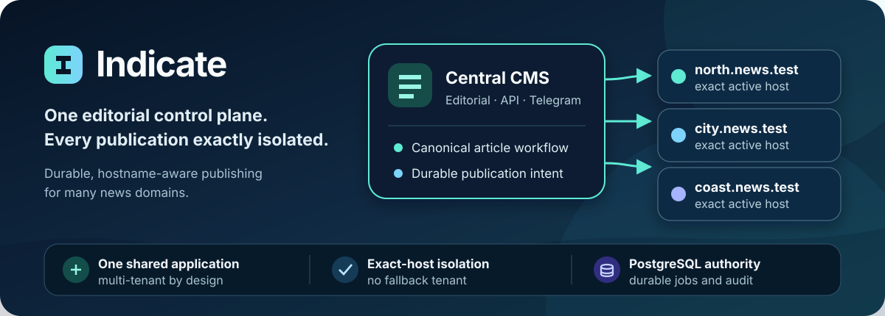

<p align="center">
  
</p>

<p align="center">
  <strong>A multi-tenant media syndication and publishing platform for operating many news domains from one central Dashboard.</strong><br />
  One shared Next.js application serves editorial workflows, APIs, webhooks, bounded publication workers, and a hostname-aware public news template, with PostgreSQL as durable authority.
</p>

<p align="center">
  <a href="https://github.com/idugeni/indicate/actions/workflows/quality-gate.yml?query=branch%3Amain"></a>
  <a href="https://nodejs.org/"></a>
  <a href="https://nextjs.org/"></a>
  <a href="https://react.dev/"></a>
  <a href="https://www.typescriptlang.org/"></a>
  <a href="https://www.postgresql.org/"></a>
  <a href="https://github.com/idugeni/indicate/commits/main"></a>
</p>

**Navigate:** [Why Indicate](#why-indicate) · [Status](#project-status) · [Architecture](#architecture) · [Prerequisites](#technology-and-prerequisites) · [Quick start](#quick-start) · [Commands](#commands) · [Release](#release-quality-and-promotion) · [Security](#security-and-tenant-isolation) · [Operations](#migrations-and-rollback) · [Docs](#documentation-and-specifications)

## Why Indicate

| Capability | What it provides |
|---|---|
| **Central Dashboard** | One protected editorial control plane shared by Dashboard, API, worker, and Telegram entry points. |
| **Exact-host isolation** | Public requests resolve one active Site by exact normalized hostname; there is no suffix match or fallback tenant. |
| **Durable publication** | Canonical articles, idempotent multi-site jobs, bounded retries, leases, fencing, and recovery remain PostgreSQL-backed. |
| **Private media** | One private R2 bucket with ownership-scoped metadata and short-lived exact-key authorization—never bucket-list access. |
| **Fail-closed release** | Configuration, policies, secure build, and readiness block advancement on failure. |

## Project status

> [!NOTE]
> **Implemented:** the repository contains the Indicate MVP, including tenant-aware Dashboard and public surfaces, publication workflows, provider adapters, exact-host routing, security controls, and automated gates.

> [!TIP]
> **Last verified CI:** [Release Quality Gate run 33383014309](https://github.com/idugeni/indicate/actions/runs/33383014309). This is recorded evidence, not a claim that current CI, live provider contracts, or any deployment is presently green.

> [!IMPORTANT]
> **Specified, not implemented:** parts of the persisted runtime-config surface have approved requirements and design artifacts, but some implementation tasks remain pending. See `docs/ARCHITECTURE.md` and the `src/data/migrations/` sequence for the current state.

> [!WARNING]
> [.env.example](.env.example) is the authority for the bootstrap environment: connections, secrets, hosts, and build-time values. Tunable policies and deployment identifiers live in PostgreSQL runtime config and are managed through the superadmin surface, not environment variables.

Production readiness is environment-dependent. Always run the applicable deterministic, provider, and readiness gates against authorized resources before making a promotion decision.

## Architecture


Indicate is a modular monolith with a fixed shared topology:

- **one** TypeScript Next.js App Router application and **one** Vercel project;
- **one** Supabase project providing **one** PostgreSQL database and Supabase Auth;
- **one** private Cloudflare R2 bucket and **one** Upstash Redis resource;
- **one** public news template for every active Site;
- **Cloudflare as sole authority** for nameservers, DNS, wildcard DNS, edge TLS proxying, and CDN behavior;
- **Vercel as hosting only**, with exact Site-domain associations—never nameserver authority or Vercel wildcard registration.

Adding an Organization, Domain, Region, or Site is a persisted-data and control-plane operation, not a deployment. PostgreSQL is authoritative for tenant, editorial, publication, audit, and recovery state; queues, caches, cron invocations, and provider state remain subordinate and recoverable.

The intended dependency direction is `src/app/` → `src/modules/` → `src/core/` + ports ← `src/integrations/`, with `src/data/` for persistence. Repository policies enforce import, dependency, deployment, migration, release, and secret boundaries.

## Technology and prerequisites

The primary stack is Next.js 16.3.5, React 19.3.0, TypeScript 6, Tailwind CSS, shadcn/ui and Radix primitives, Drizzle ORM, PostgreSQL and Supabase Auth, Cloudflare R2, Upstash Redis, and Zod.

Install or provide:

| Requirement | Purpose |
|---|---|
| Node.js **24** and npm (`engines` + `.nvmrc` pin 24.x) | Application and builds; `package-lock.json` is authoritative. |
| PostgreSQL **17** | Durable tenant, editorial, publication, and audit state (via Supabase). |

## Repository layout

| Path | Purpose |
|---|---|
| `src/app/` | Next.js App Router routing only: `(site)`, `(network)`, `(auth)`, `(dashboard)` surfaces and `api/` route handlers (health, v1, dashboard, internal, leads, network, webhooks) |
| `src/components/ui/` | Design-system primitives (shadcn/Radix) |
| `src/modules/` | Bounded contexts (`audit`, `auth`, `billing`, `content`, `dashboard`, `delivery`, `integrations`, `moderation`, `persisted-config`, `publishing`, `site`); only `dashboard`, `delivery`, and `integrations` expose a barrel `index.ts` — import other modules by file path; domain UI colocated in `*/components/` |
| `src/core/` | Shared kernel: `config/` (environment validation), errors, operation context, hostname, observability, routing, security, system, transactions |
| `src/data/` | Persistence: Drizzle schema, `repos/`, `client.ts`, and forward-only SQL `migrations/` |
| `src/integrations/` | Provider adapters: Supabase, R2 storage, Upstash Redis, Telegram, Cloudflare, Vercel |
| `src/ui/` | Shared client-safe UI utilities (`cn`, themes, hooks, site helpers) |
| `proxy.ts` | Edge middleware: hostname resolution, security headers, platform guards |
| `.agents/skills/` | Agent playbooks (`indicate-conventions`, `tenant-onboarding`, provider skills); see `AGENTS.md` for load triggers |

## Quick start

1. Install the pinned dependency graph:

   ```sh
   npm ci
   ```

2. Copy the bootstrap configuration contract and replace every placeholder with authorized **development** values:

   ```sh
   cp .env.example .env.local
   ```

   Never commit `.env.local`, credentials, database URLs, tokens, webhook secrets, signed URLs, or production host data. Next.js loads `.env.local` for application commands; export the same values into the process environment when running database tooling manually.

3. Prepare a development database when needed, then start the application:

   Apply each reviewed SQL file in `src/data/migrations/` in filename order against `DATABASE_DIRECT_URL` (via `psql` or the Supabase SQL editor), then start the application:

   ```sh
   npm run dev
   ```

   Verify with `GET /api/health` (reports configuration validity) and the application logs; the runtime schema gate fails closed on version mismatch. Runtime traffic uses `DATABASE_POOL_URL`.

## Commands

This repository currently provides these scripts (see `package.json`):

| Command | Purpose |
|---|---|
| `npm run dev` | Start the Next.js development server. |
| `npm run build` | Create the standard production build. |
| `npm run start` | Serve an existing production build. |
| `npm run typecheck` | Run TypeScript without emitting files. |
| `npm run lint` | Run ESLint with zero-warning threshold. |
| `npm run audit:production` | Audit production dependencies at high severity. |

Forward migrations are hand-written and reviewed by default, not generated. `drizzle-kit generate` is discouraged because the reviewed sequence contains PL/pgSQL functions, triggers, and row level security policies that it cannot express. Avoid editing migration metadata to conceal a failed migration outside development, and avoid application runtime credentials for migration ownership.

## Release quality and promotion (advisory — relaxed 2026-09-14)

CI runs the Release Quality Gate (`typecheck`, `lint`, production `build`) on every pull request and push to `main`. Promotion beyond CI is a manual operator decision:

- Preserve a green gate on the promoted commit when practical; promoting a red or unchecked commit needs explicit owner sign-off with a recorded risk note.
- Apply reviewed forward-by-default migrations (see [database migration operations](docs/MIGRATIONS.md)) and confirm `GET /api/health` reports a valid configuration before and after when practical.
- Prefer promoting the already-built artifact to the existing Vercel project; a second project or tenant deployment needs explicit owner approval.
- Verify production readiness against the checklist in the [production readiness and rollback runbook](docs/PRODUCTION_READINESS_RUNBOOK.md) before routing traffic.
- `npm run audit:production` audits production dependencies at high severity as part of the decision.

## Security and tenant isolation

- Every tenant operation derives exactly one authorized `organizationId`; public reads derive Organization and Site only from one exact active normalized hostname.
- Missing, malformed, unknown, ambiguous, suffix-only, cross-Organization, and unauthorized inputs never select a fallback tenant.
- Application predicates, composite foreign keys, transaction-local context, grants, and forced PostgreSQL RLS provide layered isolation.
- Absent, unauthorized, and cross-Organization resources use non-disclosing denial behavior.
- Publication jobs are durable and idempotent. PostgreSQL-time leases and fencing tokens prevent expired or stale workers from overwriting newer state.
- Redis is queue/cache acceleration and never durable authority. R2 remains private; media access is exact-key and ownership-scoped.
- Security-sensitive database changes and required append-only audit records commit atomically.
- Secrets remain in server-only environment storage and must not enter browser bundles, database content, logs, audit context, fixtures, reports, or error responses.

## Migrations and rollback

Database evolution is forward-only. Apply reviewed migrations with the direct migration credential, then run the schema gate through the pooled runtime credential before activation. Compatibility-sensitive changes follow **expand → backfill → verify → contract** across releases; destructive down migrations are not the rollback mechanism.

Application rollback selects the last schema-compatible deployment in the same Vercel project. It must preserve the current database schema and durable jobs/intents, keep Cloudflare authority unchanged, avoid duplicate infrastructure, and resume bounded reconcilers afterward. Irreversible database issues are corrected with a new forward migration.

Detailed procedures: [database migration operations](docs/MIGRATIONS.md) and [production readiness and rollback](docs/PRODUCTION_READINESS_RUNBOOK.md).

## Documentation and specifications

- [Product requirements](docs/PRD.md)
- [Architecture](docs/ARCHITECTURE.md)
- [Migration operations](docs/MIGRATIONS.md)
- [Production readiness and rollback runbook](docs/PRODUCTION_READINESS_RUNBOOK.md)
- [Contributing](CONTRIBUTING.md)
- [Security policy](SECURITY.md)
- [Support](SUPPORT.md)
- [Code of conduct](CODE_OF_CONDUCT.md)
- [Changelog](CHANGELOG.md)
- [Implemented Indicate MVP specification](.kiro/specs/indicate-mvp/)
- [Pending database-backed runtime configuration specification](.kiro/specs/database-backed-runtime-config/)

## License

Licensed under the [Apache License 2.0](LICENSE). Copyright 2026 Eliyanto Sarage. See [THIRD-PARTY-NOTICES.md](THIRD-PARTY-NOTICES.md) for upstream attributions.

All trademarks (Google, Cloudflare, Vercel, Supabase, Telegram, PostgreSQL, Next.js, React) are property of their respective owners; nominative use here implies no endorsement.

Descriptions of architecture (exact-host isolation, durable publication, private media, fail-closed) describe design intent, not an SLA — service levels are governed solely by `/terms` §17 and any signed Enterprise SOW.

---

*Indicate keeps every tenant on one shared topology: Cloudflare remains authoritative, Vercel remains hosting-only, and PostgreSQL preserves durable intent.*
