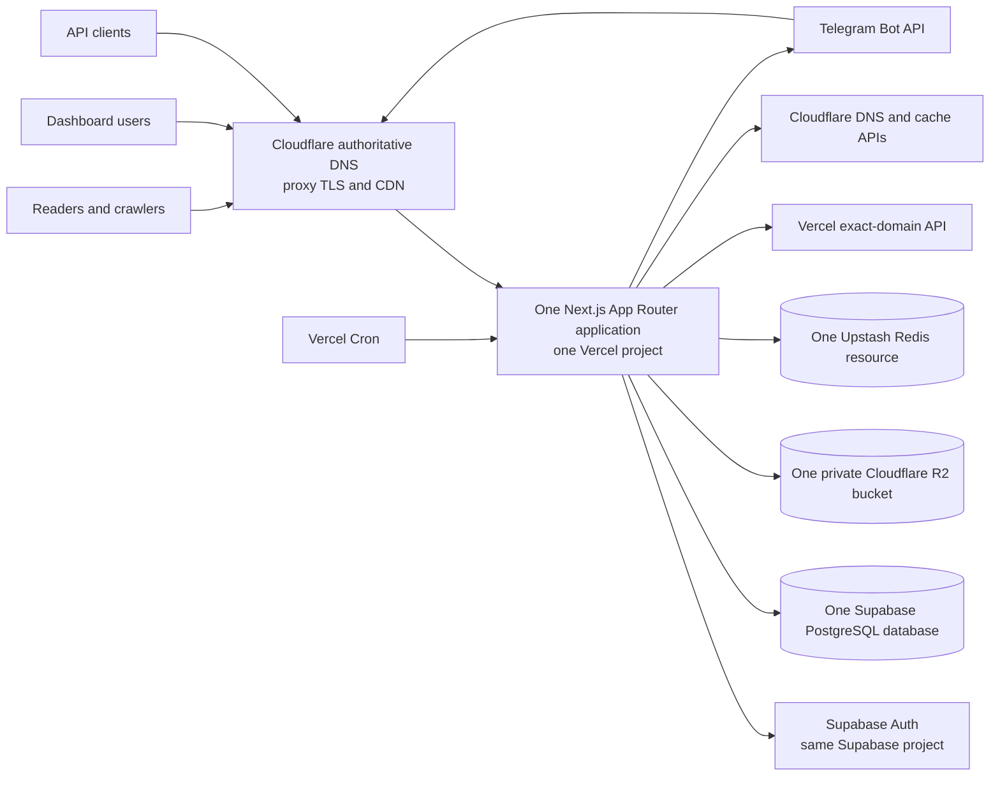
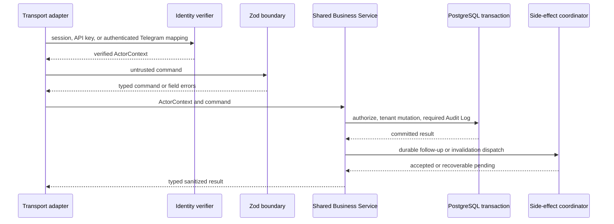
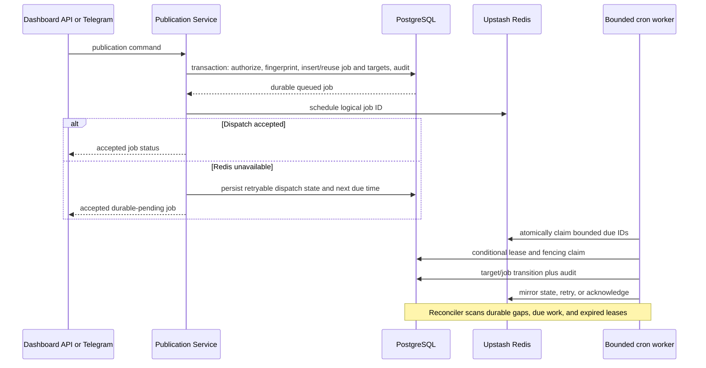

# Indicate MVP Architecture

## Review status

- **Status:** Approved
- **Approval gate:** Satisfied on 2026-08-30 for this document.
- **Approval record:** User/reviewer approval was explicitly provided through this session on 2026-08-30.
- **Source of truth:** this document.
- **Scope of this version:** Approved architecture definition. This approval clears the pre-code documentation gate for a subsequent invocation; this document does not itself perform application, dependency, infrastructure, or deployment changes.

## 1. Architecture summary

Indicate MVP is a modular monolith implemented as one TypeScript Next.js App Router application and deployed to one Vercel project. The same application serves the protected Dashboard, APIs, webhooks, short-lived background handlers, and one shared public news template for all configured publication hostnames.

The durable source of truth is one PostgreSQL database in one Supabase project. That same project supplies Supabase Auth. One private Cloudflare R2 bucket stores media, and one Upstash Redis resource coordinates publication dispatch, leases, rate limits, idempotency acceleration, and cache invalidation. Redis, Vercel Cron invocations, provider state, and caches are recoverable projections of durable PostgreSQL intent.

Cloudflare is the sole authority for nameservers, DNS records, wildcard DNS, edge TLS proxying, and CDN behavior. Vercel provides application hosting and exact custom-domain association only. The architecture never transfers nameserver control to Vercel and never uses Vercel wildcard-domain registration.

Every tenant operation carries one immutable Organization context derived from a verified actor or claimed durable record. Public operations receive one Organization only through an exact active Hostname Context. No missing, malformed, ambiguous, unauthorized, suffix-only, or substring-only request can select tenant data.

## 2. Architectural invariants

1. Exactly one application codebase, Next.js application, Vercel project, Supabase project/database/Auth instance, R2 bucket, Upstash Redis resource, and Public News Template serve every tenant and hostname.
2. Cloudflare remains authoritative for all managed nameservers, DNS, wildcard records, SSL proxy behavior, and CDN configuration; Vercel is hosting only.
3. A normalized hostname resolves only by exact equality to one reserved control-plane surface or one unique active Site; no fallback tenant exists.
4. Every tenant entity, relationship, query, mutation, job, object authorization, cache namespace, aggregate, and audit event preserves Organization ownership.
5. Canonical Article content exists once. `article_sites` stores destination assignment and current outcome without copying title or body.
6. PostgreSQL is authoritative for publication jobs, targets, state, idempotency, attempts, leases, fencing, and recovery. Redis is never the sole record.
7. Publication acceptance is transactional and Organization-scoped by Idempotency Key plus canonical Request Fingerprint.
8. Public rendering, URL generation, SEO, media access, analytics attribution, and cache identity derive from the same Hostname Context.
9. Security-sensitive database changes and required Audit Logs commit atomically. Secrets and internal diagnostics never enter public errors or audit context.
10. Dashboard, API, Telegram, background, and reconciliation adapters invoke shared application services rather than issuing tenant SQL or reimplementing business rules.
11. External effects occur only after durable intent is recorded and are resumable, bounded, and idempotent.
12. Implementation follows the recommended seven-stage sequence as a guideline; a failed Quality Gate is a warning, not a hard block on the next stage (relaxed 2026-09-14).

## 3. System topology



### Managed-resource responsibilities

| Resource | Quantity | Responsibility | Explicit boundary |
|---|---:|---|---|
| Next.js App Router application | 1 | Dashboard, APIs, webhooks, cron handlers, public template | No tenant-specific application or build |
| Vercel project | 1 | Application hosting and exact custom-domain association | No nameserver delegation, DNS authority, or Vercel wildcard registration |
| Supabase project | 1 | PostgreSQL and Supabase Auth | No per-tenant project or database |
| PostgreSQL database | 1 | Durable business state, constraints, idempotency, jobs, audit, recovery intent | All tenant records explicitly Organization-scoped |
| Supabase Auth | 1 | User session identity | Authorization remains in local Membership/Role/Permission data |
| Cloudflare R2 bucket | 1 | Private media objects | No public bucket, list grants, or per-tenant buckets |
| Upstash Redis | 1 | Queue/cache/rate-limit coordination | Recoverable projection, never durable authority |
| Cloudflare DNS/CDN | One authority across managed zones | Nameservers, DNS, wildcard records, TLS proxying, CDN | Authority is never transferred to Vercel |
| Public News Template | 1 | All root and regional public experiences | Branding/settings come from exact Site context |

## 4. Deployment and hostname architecture

### 4.1 Cloudflare authority and Vercel hosting

Each managed root domain remains a Cloudflare zone using Cloudflare nameservers. Cloudflare maintains:

- a proxied apex route targeting the single Vercel project’s stable production target, using apex flattening where needed;
- a proxied `*` route for first-level regional hostnames;
- edge TLS and CDN behavior;
- Full (strict) HTTPS from Cloudflare to the certificate-valid Vercel origin.

The architecture generates regional hostnames only in the one-label form `{regionSlug}.{rootDomain}` unless a separately reviewed certificate strategy is approved. Vercel wildcard-domain registration is prohibited because it would conflict with the Cloudflare-only authority invariant. Each active Site hostname is associated exactly with the one Vercel project.

### 4.2 Control-plane hostnames

Validated Runtime Configuration reserves:

- `indicate.web.id` for Dashboard and authentication callbacks;
- configured API hostname(s) for versioned API routes;
- configured webhook/Telegram hostname(s) for named webhook routes;
- the Vercel production URL plus `CRON_SECRET` for internal cron routes.

Control-plane matching precedes public Site lookup. A Domain, Site, wildcard, or seed candidate that normalizes to a reserved hostname is rejected before public activation.

### 4.3 Exact hostname activation saga

The Domain Provisioning Service activates one exact Site hostname through a durable, resumable saga:

1. Normalize and validate the candidate; reject reserved names, duplicate normalized values, inactive parent Domain/Region records, and incoherent Organization ownership.
2. Persist a pending activation attempt while keeping the Site non-public and non-indexable.
3. Verify the root zone’s Cloudflare nameservers, proxied apex/wildcard routes, edge certificate coverage, and Full (strict) setting.
4. Associate the exact hostname with the single Vercel project. If domain proof is requested, create the exact temporary Cloudflare TXT challenge, verify it, and remove only that challenge after success.
5. Probe HTTPS through Cloudflare, confirm production routing to the expected project, and verify the application returns the expected pending non-indexable response.
6. In one PostgreSQL transaction, activate the hostname, increment routing version, append an Audit Log, and create durable invalidation intent.

Deactivation changes database state first so public resolution stops immediately; external cleanup follows asynchronously. Reconfiguration validates the new hostname before activation and invalidates both old and new Hostname Contexts. No saga phase changes nameserver delegation.

### 4.4 Request normalization and classification

The request classifier runs before route-specific tenant data access.

```text
normalizeHostname(rawHost):
  reject missing, repeated/comma-separated, user-info, path, wildcard, and IP literal input
  remove one syntactically valid decimal port
  remove one terminal DNS dot
  convert IDN to ASCII and lowercase
  validate total and label lengths and hostname syntax
  return normalized ASCII hostname or INVALID_HOSTNAME

resolveRequest(rawHost):
  normalized = normalizeHostname(rawHost) or HTTP 400
  if normalized exactly matches a configured control-plane host:
    return that explicit control-plane route family
  site = database exact active normalized-hostname lookup
  if no site: return generic non-indexable HTTP 404
  if more than one site: return non-indexable configuration error
  return HostnameContext(site, domain, optional region, organization)
```

The direct `Host` header delivered by the configured Cloudflare/Vercel path is authoritative. Client-supplied forwarding headers cannot override it. A database exact-match resolution occurs before tenant cache use so stale caches cannot keep a deactivated mapping alive.

### 4.5 Operator versus customer organizations

An Organization is a plain tenant record (billing owner + memberships + permissions). It carries no portal semantics by itself. Two roles are distinguished by the `kind` column (`operator` vs `customer`), not by schema:

- **Operator org** — exactly one (the platform org) owns brand apex Domains, Regions, Sites, Site Settings, and the editorial workspace for every portal network it manages, up to thousands of domains. The apex Site (`region_id` null) is the curated headline portal; regional Sites (`{regionSlug}.{rootDomain}`) are per-area channels. Apex aggregation is explicit curation via `article_sites` assignment, never automatic duplication.
- **Customer org** holds billing, publishers, and memberships only. It holds no Domain, Region, or Site rows until it activates its own portal. Its business profile lives in `customer_metadata` under a generic contract (`segment`, `customer_type`, `city`, `address`, `phone`, `site_url`) that works for any segment nationwide — never UPT-specific keys. A customer participates in an operator portal as a `publishers` row (plus `official_affiliations` per Site) inside the operator org — never as a second org context.

`domains` is the brand registry and lives outside `organizations`: one row per apex, owned by exactly one operator org for billing and zone stewardship. Domain settings live in `domains`/`sites`/`site_settings`, never in the org record. No table changes are needed to add regions, channels, customer segments, or content sources; growth is rows, not schema.

## 5. Modular monolith boundaries

### 5.1 App Router route groups

Route groups organize `src/app/` by surface without changing URL paths. `src/app/` contains strictly Next.js App Router concerns (page, layout, loading, error, not-found, route handlers). Design-system primitives live in `src/components/ui/` (alias `@/components/*`), domain UI is colocated in `src/modules/*/components/`, business logic lives in `src/modules/` (file-path imports; only `dashboard`, `delivery`, and `integrations` expose a barrel `index.ts`), shared kernel in `src/core/` (config at `src/core/config/`, observability, security, hostname, routing, system), persistence in `src/data/` (schema, repos, migrations), provider adapters in `src/integrations/`, and shared client-safe UI utilities in `src/ui/`.

```text
src/app/
├── (site)/   # Service pages on the Dashboard host (/about, /services, /pricing, legal)
├── (network)/      # Tenant-facing public content (articles, categories, search)
├── (auth)/        # Authentication flows (/sign-in, /auth/callback)
├── (dashboard)/         # Protected editorial Dashboard workspace
├── api/           # Route handlers (health, v1, dashboard, internal, leads, network, webhooks)
├── layout.tsx     # Root layout (fonts, globals, hostname-aware brand theming)
├── not-found.tsx
└── error.tsx / global-error.tsx
```

### 5.2 Source Architecture & Layer Boundaries

Application source code is consolidated under `src/`:

```text
src/
├── app/          # Next.js App Router routing only
├── components/   # Design-system primitives only (ui); domain UI is colocated in modules/*/components
├── modules/      # Bounded contexts (file-path imports; only dashboard,
│                 # delivery, and integrations expose index.ts): audit, auth,
│                 # billing, content, dashboard, delivery, integrations,
│                 # moderation, persisted-config, publishing, site
├── data/         # Single canonical database home (schema, repos, migrations, client.ts)
├── core/         # Shared kernel: config/, errors, operation-context, result, hostname, observability,
│                 # routing, security, system, transactions
├── integrations/ # Provider adapters: supabase, storage (R2), redis (Upstash), telegram, cloudflare, vercel
└── ui/           # Shared client-safe UI utilities: cn, themes, hooks, site helpers
```

Rules:

- Domain and pure policy modules import no framework or provider clients.
- Application services receive a verified context, validated command, and injected ports; they do not read request globals.
- Infrastructure adapters are server-only and map provider responses to domain-safe types.
- Dashboard, API, Telegram, cron, and public adapters authenticate/resolve context, validate input, invoke one use case, and map typed outcomes.
- Adapters cannot issue tenant SQL directly.
- Provider SDK types cannot cross into domain or application interfaces.
- Client bundles receive only explicitly public Supabase Auth configuration and no privileged credentials.

## 6. Context and trust boundaries

```ts
interface ActorContext {
  actorType: 'user' | 'api_key' | 'telegram' | 'system';
  actorId: string;
  organizationId: string | null;
  permissionSet: ReadonlySet<PermissionName>;
  entryPoint: 'dashboard' | 'api' | 'telegram' | 'worker' | 'reconciler';
  requestId: string;
}

interface HostnameContext {
  normalizedHostname: string;
  organizationId: string;
  domainId: string;
  siteId: string;
  regionId: string | null;
  routingVersion: number;
}
```

`organizationId` never comes from an untrusted request body. It is derived from:

- a verified Supabase session plus active local Membership;
- an active API Key lookup, hash verification, scope, and ownership;
- an authenticated Telegram webhook plus active identity mapping;
- a worker’s atomically claimed durable job;
- an exact active public Hostname Context.

An operation with missing or conflicting tenant/public context is rejected before tenant repository access. Active Organization changes force reauthorization and disposal of prior tenant-scoped query/UI state.

## 7. Primary application flows

### 7.1 Dashboard, API, and Telegram mutation flow



Validation, permission, tenant ownership, optimistic version, mutation, and required Audit Log precede success. Telegram owns conversational state and transport formatting only; it maps to the same service commands and schemas as Dashboard/API.

### 7.2 Public rendering flow

1. Normalize and classify the request hostname.
2. Resolve one exact active Hostname Context from PostgreSQL.
3. Build a public query using Organization, Site, optional Region, canonical path, normalized query, locale, preview/auth state, and content/routing versions.
4. Load a context-validated cache entry or query only active published Article Site relationships and same-organization references.
5. Render shared Server Components using only persisted settings from the resolved Site; unavailable assets use a Site-safe static fallback.
6. Build canonical URLs, metadata, JSON-LD, robots, sitemap, and RSS from the same Hostname Context.
7. Permit public cache headers only for anonymous successful GET/HEAD responses. Control-plane, preview, error, and authorization-bearing responses are private or no-store.

### 7.3 Publication acceptance and dispatch



## 8. Application services

| Service | Core responsibility | Principal guarantees |
|---|---|---|
| AuthorizationService | Membership/Role/Permission, API Key, Telegram, platform authorization | Active exact scope; non-disclosing denial |
| OrganizationService | customer, subscription, Membership, Role commands | Platform permission separation and audit atomicity |
| DomainProvisioningService | hostname activation/deactivation | Cloudflare authority, exact Vercel association, resumable saga |
| SiteService | Site and Site Settings lifecycle | Same-organization Domain/Region/media and optimistic versioning |
| PublisherService | registry, verification, affiliations | Evidence lifecycle and verified claim limits |
| ArticleService | canonical lifecycle and Site assignment | One canonical row, coherent references, deduplicated assignment |
| MediaService | upload reservation/completion/read/archive | Required key prefix, exact-key authorization, metadata validation |
| PublicationService | request, status, and result | Canonical fingerprint and transactional tenant idempotency |
| PublicationWorker | claims, transitions, retries, reconciliation | Bounded leases, fencing, retry policy, legal state transitions |
| NetworkContentService | listing, detail, Category, search, feed | Published Site relation and exact context filters |
| AnalyticsService | dashboard and aggregate queries | Organization predicate in every calculation |
| SeoService | metadata, robots, sitemap, RSS | Hostname-correct, escaped, Site-only output |
| ApiKeyService | issue, authenticate, rotate, revoke | One-time plaintext, one-way verification, audited atomic lifecycle |
| WebhookService | authenticate, freshness, replay, outcome | One atomic source/replay claim and logical outcome |
| AuditService | append and query | Append-only, redacted, tenant-filtered |
| CacheInvalidationService | plan, dispatch, reconcile | Durable tasks and Site-safe fallback |

### 8.1 Billing model (manual activation)

There are no packages, tiers, or orders — there is exactly one price:
Rp550.000 per month, PPN-inclusive, pinned by schema, service, and database
check. A subscription is a
status-only row (`active` / `suspended` / `cancelled`) with no plan and no
period: an active organization keeps running indefinitely, with no grace,
expiry sweep, or quota enforcement. Purchase happens out-of-band (buyer
contacts the owner); the owner flips the status in the superadmin dashboard
after manual payment. Each month the owner processes one manual Rp550.000
bank-transfer payment and records one paid `invoices` row for that month
(numbered `amount_idr` rows with void support); the subscription itself has
no period and stays active until the owner cancels it. Member onboarding via invites is unrelated to billing
and stays.

## 9. Data architecture

### 9.1 Conventions

- IDs are server-generated UUIDs; timestamps are UTC `timestamptz`.
- Every tenant table has non-null `organization_id` and suitable status/version timestamps.
- Parent tables expose `UNIQUE (organization_id, id)` so child tables can use composite foreign keys.
- Application SQL includes `organization_id` in every tenant predicate even when database policies provide defense in depth.
- Mutable editorial/configuration records use status, active, or archive fields rather than destructive deletion when history matters.
- Hostnames, slugs, replay IDs, idempotency keys, API lookup IDs, and object keys have bounded database checks.
- PostgreSQL enum/check constraints encode finite states.
- Runtime database traffic uses the Supabase transaction pooler; migrations use a separate direct connection and migration role.
- Runtime database grants and a trigger reject Audit Log UPDATE/DELETE.

### 9.2 Required entities

Core identity and authorization:

- `users`, `organizations`, `memberships`, `roles`, `permissions`, `role_permissions`;
- `api_keys`, `subscriptions`, `telegram_identity_mappings`.

Domain and site:

- `domains`, `regions`, `sites`, `site_settings`, `domain_activation_attempts`.

Editorial and publisher:

- `publishers`, `official_affiliations`, `categories`, `authors`, `articles`, `article_sites`.

Media:

- `media`, `media_key_reservations`, `object_cleanup_tasks`.

Publishing:

- `publishing_jobs`, `publishing_job_targets`, `publication_transition_receipts`.

Security and coordination:

- `webhook_replay_claims`, `audit_logs`, `invalidation_tasks`, `seed_runs`.

### 9.3 Organization coherence

Every tenant parent has a composite Organization/ID key. Composite foreign keys enforce that:

- Membership User, Role, and Organization agree;
- Role Permissions use a Role from the same Organization and a compatible tenant or platform Permission;
- Telegram mapping User, Role, Membership, and Organization agree;
- Site Domain and optional Region belong to the Site’s Organization;
- Article Region and optional Publisher, Category, Author, and lead Media belong to the Article’s Organization;
- Article Site references an Article and Site from one Organization;
- Official Affiliation references a Publisher and Site from one Organization;
- Publishing Job, Article, Article Site, and job targets share one Organization.

Service validation returns one non-disclosing denial for absent, unauthorized, and incoherent references. Multi-record changes and required audits execute in one transaction.

### 9.4 Identity and authorization constraints

- `users.auth_user_id` is unique.
- Membership is unique per Organization/User and references exactly one Role.
- Roles are unique by Organization/name.
- Platform permissions are explicit records and are never inferred from tenant roles.
- API Key lookup IDs are unique; persisted values contain lookup metadata, per-key salt, one-way derived hash, status, scopes, expiry, and predecessor references, never plaintext.
- Telegram identities are uniquely mapped under the defined Organization/source identity and require an active coherent Membership.

### 9.5 Domain and site constraints

- Domain normalized hostnames are globally unique.
- Site normalized public hostnames are globally unique and indexed for exact active lookup.
- A Site references exactly one same-organization Domain and at most one same-organization Region.
- Apex Site hostname equals the Domain hostname; regional Site hostname equals `{region.slug}.{domain.normalized_hostname}`.
- Reserved control-plane conflicts are rejected before writes or activation.
- Routing and content versions support safe cache validation and invalidation.

### 9.6 Canonical editorial model

`articles` is the only canonical body/source store. `article_sites` contains the same-organization Site assignment, current publication state, generated URL, publication timestamp, attempt/version, sanitized failure, and optional per-site overrides (`custom_title`, `custom_description`, `custom_image_media_id`). It has a unique Organization/Article/Site key and never stores body copy — only the canonical article holds the body.

Article writes use an Organization, ID, and expected version predicate. A stale update affects zero rows and returns a conflict. Archive retains canonical content and all relationships.

Publisher changes that invalidate identity/evidence return verification to a state requiring a new decision. Official Affiliation records carry Site, institution, claim scope, evidence, and active/verified state.

### 9.7 Media model

A Media record uses exactly one ownership mode: Article owner, Site owner, or Organization asset. Database checks enforce owner-compatible prefixes:

- `articles/{articleId}/`;
- `sites/{siteId}/`;
- `assets/`.

`media_key_reservations.object_key` is globally unique. Reservation records remain as used/occupied tombstones so keys are never recycled. An R2 object cannot become public merely because a reservation or object exists; active metadata and authorization graph checks are required.

### 9.8 Publishing model

`publishing_jobs` contains Organization, Article, Idempotency Key, fingerprint/version, state, canonical options, dispatch status/attempts/next due time, worker lease/fence, and final timestamps. `(organization_id, idempotency_key)` is unique.

`publishing_job_targets` links the job to Article Site records, preserving execution history, state snapshot, attempt, fencing, retry timing, and sanitized errors. A partial unique constraint permits only one active nonterminal target owner per Article Site. `publication_transition_receipts` makes incomplete acknowledgements recoverable and idempotent.

## 10. Authentication and authorization

### Dashboard

Supabase SSR cookie validation resolves the external Auth identity to one local User. Protected adapters then resolve an active Membership in the selected Organization and Role Permissions. A missing session is rejected before Organization data loads.

### API keys

Key format separates a non-secret lookup identifier from a high-entropy secret. Issuance returns plaintext once. Persistence stores a random salt and slow one-way derived verification value. Authentication uses constant-time comparison, active/expiry checks, Organization ownership, and scope checks. Rotation inserts a replacement and revokes its predecessor in one audited transaction.

### Telegram

Telegram requests validate the configured secret header, bounded update freshness, and atomic replay claim before identity mapping. The mapping must resolve to an active coherent User/Membership/Role in one Organization. Telegram then invokes shared Zod schemas and Business Services.

### Workers

A worker starts without tenant authority. It atomically claims a durable job, adopts that job’s Organization, and rechecks the job, Article, Sites, Article Sites, and Media before processing. Every write includes Organization and current fencing token.

### Non-disclosing denial

Absent, unauthorized, and cross-organization resources map to the same external status and response shape. Internal audit codes may distinguish causes but do not expose foreign identifiers.

## 11. Media architecture

1. Authenticate and authorize media permission; validate filename, type, declared size, purpose, and owner with Zod.
2. Verify Article/Site ownership and choose exactly one required prefix.
3. Generate a sanitized filename plus collision-resistant component and attempt a globally unique PostgreSQL key reservation.
4. If reservation conflicts, generate another bounded candidate without modifying existing object or metadata.
5. HEAD the reserved R2 key. If an orphan object already exists, mark the reservation occupied and choose another candidate.
6. Issue a short-lived exact-key PUT authorization for the declared content type; never audit the signed URL.
7. On completion, HEAD the object and compare type, bounded size, checksum, and reservation metadata.
8. On mismatch, reject activation and create exact-key cleanup intent.
9. On match, create/activate Media metadata, consume the reservation, and append Audit Log in one database transaction.
10. For public reads, resolve Hostname Context and prove either active Site Settings reference or an Article published to that Site before issuing a short-lived exact-key GET authorization.
11. Serve reads as edge-cacheable 307 redirects to the signed URL (`public, max-age=60, s-maxage=60, stale-while-revalidate=30`), never the bytes. The 60s edge TTL stays far below the shortest read authorization TTL, so a cached redirect can never outlive its signature by more than the bound.
12. Listing thumbnails are derived server-side from the reserved key (`-thumb` infix, same prefix/token), verified like full objects at completion, and served through the same route with `?variant=thumb` (a distinct edge key). Absence or mismatch degrades to the full object; it never blocks activation.

Edge-cache purge contract: every invalidation task carrying `mediaIds` also purges `https://{hostname}/api/network/media/{mediaId}` and its `?variant=thumb` twin alongside the HTML paths. Between a media mutation and the dispatcher run, plus at most 60s of edge TTL, a stale redirect may persist; the R2 object itself is private and short-lived-signed either way.

No flow grants bucket list, prefix access, public bucket access, or cross-Site fallback.

## 12. Publication state, idempotency, and recovery

### 12.1 Canonical fingerprint

The Request Fingerprint is a versioned SHA-256 digest (`FINGERPRINT_VERSION = 1`, `v1:<hex>` in `src/modules/publishing/publication-policy.ts`) of canonical serialization containing:

- `organizationId`;
- `articleId`;
- sorted distinct target Site IDs;
- normalized publication options;
- canonicalized per-site overrides, included only when non-empty.

Permutations and duplicate target representations converge. A semantic change in Organization, Article, distinct targets, options, or overrides produces another fingerprint subject to normal cryptographic assumptions — the same key, sites, and options with different overrides yield `IDEMPOTENCY_CONFLICT`, not reuse.

### 12.2 Transactional acceptance

The acceptance transaction:

1. validates input and Idempotency Key;
2. authorizes the Article and every distinct active target Site in one Organization;
3. calculates the fingerprint;
4. inserts or reuses one job under `(organization_id, idempotency_key)`;
5. returns the existing job for a matching fingerprint;
6. returns an idempotency conflict without mutation for a different fingerprint;
7. reconciles exactly one Article Site per target;
8. inserts immutable job targets and initial queued states;
9. appends the acceptance Audit Log;
10. commits before Redis dispatch.

### 12.3 State machines

Publishing Job allowed transitions:

```text
queued     -> processing | retrying | failed
processing -> published  | retrying | failed
retrying   -> processing | failed
published  -> published  (idempotent repeat)
failed     -> failed     (idempotent repeat)
unpublished -> unpublished (idempotent repeat)
```

Article Site allowed transitions:

```text
queued     -> processing
processing -> published | retrying | failed
retrying   -> processing | failed
published  -> published (idempotent repeat) | unpublished (withdrawal)
failed     -> failed (idempotent repeat) | retrying (requeue)
unpublished -> unpublished (idempotent repeat)
```

Withdrawing a published target sets target and Article Site state to `unpublished`, clears `published_url`/`published_at`, bumps the version, and enqueues public invalidation (`src/data/repos/publishing/repository.ts`).

Every other transition returns `INVALID_STATE_TRANSITION` and preserves state and outcome. Repeated terminal transitions preserve URL, timestamp, sanitized failure, and result.

Job aggregation after target mutation is exact (`aggregateJobState` in `src/modules/publishing/publication-policy.ts`):

1. any processing target -> `processing`;
2. otherwise any retrying target -> `retrying`;
3. all published -> `published`;
4. all published/failed with at least one failed (no unpublished present) -> `failed`;
5. all published/failed/unpublished with at least one unpublished -> `unpublished` (unpublished wins over failed in mixed terminal sets);
6. otherwise -> `queued`.

### 12.4 Redis dispatch and claims

After database commit, the service schedules the logical job ID in an environment-namespaced Redis sorted set. If Redis fails, database dispatch fields record retryable intent and next due time. A reconciliation scan can always recover the job.

An atomic Redis operation moves a bounded number of due IDs into a leased set and returns explicit claim tokens. PostgreSQL then performs the authoritative conditional claim, increments `fencing_token`, and sets `lease_expires_at`. Every subsequent worker write includes Job/target ID, Organization, expected state/version, and fencing token. A stale token updates zero rows.

### 12.5 Retry policy

Validated Runtime Configuration supplies bounded attempt counts and delay schedules for dispatch and target processing. Published targets are never retried. Retry planning schedules only incomplete retryable targets. Non-retryable failures or exhausted attempts transition to failed.

### 12.6 Reconciliation

A secured short-lived cron handler operates in bounded worker and reconciliation modes. Durable indexed scans find:

- queued/retrying jobs without confirmed dispatch;
- due retries;
- expired worker leases;
- incomplete transition/audit acknowledgements;
- pending invalidation and media cleanup tasks.

Scans use short transactions and row locking suitable for transaction-pooled serverless access. Duplicate, overlapping, or missed cron invocations are safe: they reuse logical IDs, conditional claims, unique constraints, leases, and fencing. No long-running worker or exactly-once scheduler assumption exists.

### 12.7 Publication result

The result is a database projection containing:

- persisted terminal job state;
- count of Article Site outcomes in `published` state;
- exactly the persisted generated URLs from those published outcomes.

Sanitized failures contain stable codes and bounded context but no provider secrets, stack traces, raw bodies, or signed URLs.

## 13. Cache architecture

### 13.1 Layers

- Next.js data/full-route cache for public query results, tagged by host, Organization, Site, Article, Category, Publisher, and SEO dependencies. Lapisan ini dimigrasi ke Cache Components (`cacheComponents`, `use cache`, `cacheLife`, `cacheTag`) secara bertahap mulai grup `(site)`; kunci cache wajib mengikuti identitas §13.2.
- Cloudflare CDN for anonymous successful public GET/HEAD responses; URL identity includes scheme, normalized host, path, and normalized query.
- Upstash version and invalidation coordination; Redis is not the sole rendered-content store.

### 13.2 Identity

A canonical cache identity contains:

```ts
interface CacheIdentityInput {
  normalizedHostname: string;
  organizationId: string;
  siteId: string;
  regionId?: string;
  locale: string;
  path: string;
  normalizedQuery: string;
  preview: boolean;
  authClass: 'anonymous' | 'authenticated';
  routingVersion: number;
  contentVersion: number;
}
```

Serialization orders keys and query pairs before hashing. Missing hostname context disables tenant caching. Each hit compares embedded hostname, Organization, Site, and versions with the current context. A mismatch is discarded and reloaded. Preview/authenticated content cannot share anonymous public keys.

### 13.3 Durable invalidation

A content/configuration mutation creates `invalidation_tasks` in the same transaction. The coordinator plans exact affected surfaces and then:

- revalidates Next.js tags and paths;
- updates namespaced Redis versions;
- purges exact Cloudflare URLs or Site hostname scope.

Article/publication, Site Settings, hostname/Region, Publisher identity/verification/affiliation, and public media-reference changes cover listing, detail, Category, search, media, SEO, sitemap, RSS, old-host, and new-host partitions. On failure, a Site-level bypass version prevents stale cross-context use while bounded retries or a broader Site purge proceed. Unrelated Sites are not invalidated.

## 14. SEO architecture

A pure Absolute URL Builder accepts only Hostname Context and canonical path; untrusted request host values never reach it. A pure SEO Document Builder produces escaped title/description, canonical, Open Graph, NewsArticle, Breadcrumb, Organization, and WebSite models. Dedicated serializers emit HTML metadata, robots text, sitemap XML, RSS XML, and safe JSON-LD.

Only active, published, Site-visible Article URLs enter sitemap or RSS. Official claims require a currently verified Publisher and active Official Affiliation matching the Site and claim scope. Unknown hosts, pending activation, branded 404s, and sanitized errors emit `noindex, nofollow` and no canonical or structured references to another Site. JSON-LD escapes characters unsafe in HTML script context; XML/RSS serializers escape untrusted text.

## 15. Webhooks, replay, and rate limits

Generic webhook processing verifies a source-specific signature over the raw body, checks a bounded timestamp, and atomically inserts unique `(source, replay_id)` before tenant mutation. The claim remains effective for at least the freshness window. Duplicates return the persisted logical outcome instead of executing again.

Rate-limit identity is:

- `endpointClass:organizationId:actorId` for authenticated traffic;
- configured endpoint class plus validated Cloudflare request-source identity for unauthenticated traffic.

Validated bounded policies use atomic Redis operations. Security-sensitive mutation and webhook routes fail closed if enforcement is unavailable. Only explicitly classified low-risk public reads may use conservative fallback behavior. Excess requests return HTTP 429 and bounded retry guidance.

## 16. Audit architecture

Audit Logs are append-only tenant records containing actor type/ID, Organization, entry point, action, target type/ID where safe, outcome, timestamp, request ID, changed fields, and redacted before/after values.

Security-sensitive changes and required audits execute in one transaction. Audit failure rolls back the mutation and prevents acknowledgement. Database grants and a trigger reject application UPDATE/DELETE. Queries always include Active Organization and optional actor/action/target/outcome/date filters. Post-response work that may be lost or retried (notifications, non-critical metrics/projections) may use Next.js `after()`; required audits and `invalidation_tasks` never move there.

Denied requests record enough context for security review without disclosing a foreign target to the requester. Audit content excludes plaintext secrets, hashes, signatures, signed URLs, temporary credentials, raw provider failures, and stack traces.

## 17. Error and transaction model

Domain/application code returns typed outcomes. Only adapters map them to HTTP, Dashboard, or Telegram presentation.

```ts
type AppErrorCode =
  | 'INVALID_INPUT'
  | 'INVALID_HOSTNAME'
  | 'UNAUTHENTICATED'
  | 'RESOURCE_UNAVAILABLE'
  | 'FORBIDDEN'
  | 'CONFLICT'
  | 'IDEMPOTENCY_CONFLICT'
  | 'INVALID_STATE_TRANSITION'
  | 'RATE_LIMITED'
  | 'DEPENDENCY_UNAVAILABLE'
  | 'CONFIGURATION_INVALID'
  | 'INTERNAL_ERROR';
```

`RESOURCE_UNAVAILABLE` is the common external result for absent, unauthorized, and cross-organization resources. Field errors expose stable paths, never raw secret values.

Transaction rules:

1. Validate and authorize before mutation.
2. Place same-database changes and required audits in one short transaction.
3. Use unique constraints, row locks, expected versions, and fencing predicates for concurrency.
4. Do not hold database transactions across Cloudflare, Vercel, R2, Redis, or Telegram calls.
5. Record durable intent first, perform external effects second, and reconcile incomplete effects.
6. A transition is acknowledged only after state and audit commit.
7. Sanitize provider errors at the infrastructure boundary.

## 18. Failure recovery

| Failure | Durable behavior | Recovery path |
|---|---|---|
| Redis enqueue/mirror unavailable | Job remains queued/retrying with due fields | Reconcile PostgreSQL and reschedule same job ID |
| Cron missed, duplicated, or overlapped | No dependence on invocation identity | Bounded due scans, leases, fencing, idempotent transitions |
| Worker timeout or crash | Lease and incomplete target remain durable | Expired lease reclaimed with a new fencing token |
| R2 object exists but metadata activation fails | Object remains inactive and private | Exact-key cleanup task retries |
| R2 metadata mismatch | Reservation rejected; no Media activation | Cleanup task and new reservation on retry |
| Cloudflare/Vercel activation phase fails | Site remains pending/inactive and non-indexable | Resume from persisted activation phase |
| Cache purge/revalidation fails | Site bypass marker and pending task | Bounded retry, then broader Site-hostname purge |
| Telegram reply fails after committed mutation | Mutation/audit remain committed | Replay returns persisted logical outcome; optional bounded reply retry |
| Audit insert fails | Whole security-sensitive transaction rolls back | Retry full command under same idempotency/version rules |
| Migration fails | Release is not promoted | Correct with forward migration or compatible rollback |
| Seed mutation fails | Entire seed transaction rolls back | Report sanitized failure and rerun same configuration |

## 19. Runtime configuration and secret ownership

One server-only Zod contract validates at build/promotion and process startup:

- control-plane hosts and tenant root hosts (unbounded; resolved from persisted domain records);
- Supabase public Auth values, privileged server Auth value, pooled runtime DB URL, and direct migration DB URL;
- Cloudflare zone IDs, expected nameservers, least-privilege DNS/cache token, proxy and SSL expectations;
- Vercel project identifiers, token, and production target;
- R2 account, single bucket, credentials, media limits, and signed authorization TTLs;
- Upstash endpoint/token, one environment namespace, queue/lease limits, rate policies;
- publication batches, safety deadline, bounded attempt/delay schedules, and reconciliation interval;
- Telegram bot token, secret header, webhook URL, freshness and replay windows;
- cron secret, redaction policy version, cache versions/TTLs, default locale, and fallback assets.

Secrets exist only in Vercel server environment values and least-privilege provider credentials. `NEXT_PUBLIC_*` is limited to explicitly public Supabase browser configuration. Validation errors report field path and category but never value. Persisted configuration snapshots store non-secret versions and fingerprints only.

## 20. Migration, seed, promotion, and rollback

### 20.1 Migrations

Drizzle migrations are forward-only and reviewed. Runtime uses a pooled connection; migrations use a distinct direct credential. Each release declares the minimum schema version. A missing or failed migration prevents activation. Destructive evolution uses expand, backfill, verify, and contract across releases while preserving compatibility long enough for rollback.

### 20.2 Seed reconciliation

The seed command:

1. parses tenant root hostnames from persisted domain records with no fixed count;
2. normalizes and rejects invalid, duplicate, reserved, or production-hardcoded values;
3. validates Wonosobo, Magelang, and Semarang stable descriptors;
4. opens one transaction and takes a seed-run lock;
5. upserts by stable external key;
6. preserves stable IDs and changes only non-identity attributes;
7. records created, updated, unchanged, and failed counts;
8. rolls back fully on any error.

Additional Central Java regions use the same data path without source changes.

### 20.3 Promotion

1. Confirm `docs/ARCHITECTURE.md` exists and has explicit approval.
2. Run deterministic typecheck and lint checks.
3. Validate Runtime Configuration and provider connectivity without tenant mutation.
4. Apply reviewed Drizzle migrations with the direct migration credential and verify schema version.
5. Deploy the one application to the one Vercel project without changing production traffic.
6. Validate Supabase Auth/database, private R2, Upstash, Telegram webhook, cron secret, Cloudflare authority/routes/proxy/TLS, and every active Site’s exact Vercel association.
7. Run smoke checks across control-plane hosts and every active root domain and region.
8. Promote only if all checks pass.

### 20.4 Rollback

Rollback points the single Vercel project at the last schema-compatible application deployment. Forward-fix migrations are preferred after irreversible schema change. Durable activation, invalidation, queue, cleanup, and audit intent remains recoverable. Rollback never creates another topology or transfers Cloudflare nameserver authority.

## 21. Quality architecture (advisory — relaxed 2026-09-14)

Recommended deterministic single-run checks are:

- TypeScript typecheck;
- lint;
- migration/environment checks;
- client-bundle and artifact secret scans.

Every tenant-sensitive stage should verify same-organization success, absent-resource denial, cross-organization denial, and mutation/audit failure atomicity. Any cross-organization content, media, cache, credential, job, analytics, or audit result warns (does not hard-fail the stage in relaxed mode).

## 22. Recommended seven-stage sequence (advisory — relaxed 2026-09-14)

Implementation may begin without waiting for document approval (approval recorded 2026-08-30 is kept as history). The order below is preferred, not enforced:

1. **Major Baseline — Foundation:** one Next.js app, approved stack, Runtime Configuration, deployment contracts, and Quality Gate tooling.
2. **Major Tenancy — Persistence and authorization:** Drizzle schema/migrations/seed, Supabase Auth, tenant transactions, Membership, RBAC.
3. **Major Dashboard — Business and Dashboard:** shared services, Dashboard modules, Publisher Registry, canonical Articles, filtering, Basic Analytics, Audit Logs.
4. **Major Publishing — Media and publication:** private R2 media, durable jobs, Upstash dispatch, idempotency, leases/fencing, bounded retries, results.
5. **Major Delivery — Public delivery:** Cloudflare/Vercel exact-domain activation, hostname resolver, shared public template, SEO, cache/invalidation.
6. **Major Integrations — External entry points:** Telegram, API Keys, rate limiting, replay defense, customer/subscription administration.
7. **Major Release — Production readiness:** automated validation across all active root domains and regions, starting with Wonosobo, Magelang, and Semarang.

Each stage ideally follows the prior stage's Quality Gate, but stages may overlap or reorder with a brief recorded rationale. No prior approval required in relaxed mode.

## 23. Architecture decision boundaries (advisory defaults — relaxed 2026-09-14)

The following are discouraged by default but allowed with owner approval and a brief note — no full requirements/architecture revision required:

- additional tenant applications, Vercel projects, Supabase projects/databases/Auth instances, R2 buckets, Redis resources, public templates, or deployments;
- Vercel nameserver delegation, Vercel DNS authority, or Vercel wildcard-domain registration;
- another primary database, ORM, Auth provider, object store, queue, DNS provider, host, CSS/component system, messaging platform, validation library, unit-test framework, or end-to-end framework;
- direct tenant SQL from transport adapters;
- browser access to privileged database/provider credentials;
- public R2 bucket or prefix-wide authorization;
- tenant selection from request bodies or fallback hostname matching;
- Redis or cron as the durable publication authority;
- database transactions held open during provider calls;
- unbounded retries or long-running workers;
- mutation success when the required Audit Log did not commit.

## 24. Reviewer approval and implementation-stage confirmations

The user/reviewer explicitly approved this architecture through this session on 2026-08-30, satisfying the pre-code documentation gate. The following operational confirmations remain required at the applicable implementation or promotion stage:

1. **Exact-domain operations:** confirm that every active Site will be individually associated with the one Vercel project while Cloudflare retains nameserver/DNS authority.
2. **Provider capacity:** confirm the Vercel plan supports the projected exact-domain count, cron frequency, execution duration, and the unbounded domain-plus-regional-Site scale target.
3. **TLS convention:** confirm one-label regional hostnames fit Cloudflare certificate coverage and that Full (strict) origin validation succeeds.
4. **Numeric runtime bounds:** approve retry attempts/delays, lease durations, worker batch/deadline, media limits, signed URL TTLs, cache TTLs, rate limits, webhook freshness, and replay retention.
5. **Credential ownership:** approve least-privilege roles, storage, rotation, and incident ownership for Cloudflare, Vercel, Supabase runtime/migration, R2, Upstash, Telegram, webhook, and cron secrets.
6. **Database defenses:** confirm the composite-foreign-key, transaction-local context, RLS defense-in-depth, append-only audit grants/trigger, and transaction-pooler approach.
7. **Recovery objectives:** approve operational alerting and response expectations for pending activation, dispatch gaps, expired leases, invalidation bypass, and cleanup backlogs.
